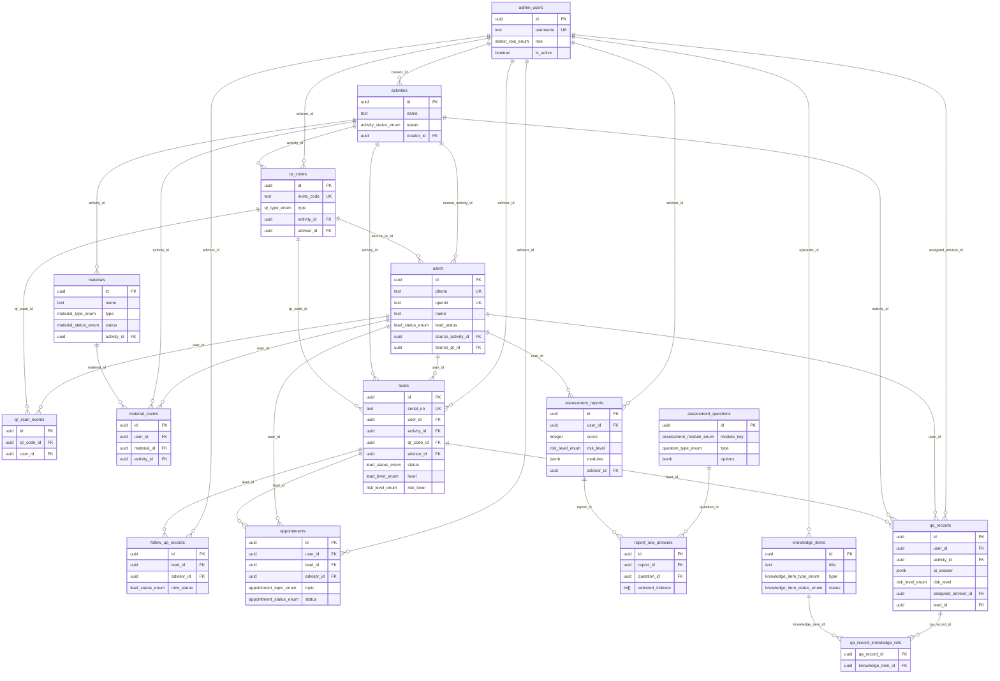

# 数据库设计总览

**版本**：v1.0.0  
**编写日期**：2026-06-10  
**数据库**：Supabase PostgreSQL  
**项目阶段**：MVP，核心表全部完成

---

## 一、Migration 执行顺序

必须按以下顺序执行，后续 migration 依赖前序表结构：

| 顺序 | 文件名 | 创建的表 | 依赖 |
|------|--------|---------|------|
| 1 | `20260610120000_create_users_table.sql` | `admin_users`、`users` | 无 |
| 2 | `20260610120001_create_activities_qrcodes_table.sql` | `activities`、`qr_codes`、`qr_scan_events`；补全 `users` 外键 | migration 1 |
| 3 | `20260610120002_create_materials_table.sql` | `materials`、`material_claims` | migration 1（users） |
| 4 | `20260610120003_create_leads_table.sql` | `leads`、`follow_up_records`、`appointments` | migration 2（activities、qr_codes） |
| 5 | `20260610120004_create_assessment_table.sql` | `assessment_questions`、`assessment_reports`、`report_raw_answers`；定义 `risk_level_enum` | migration 2（qr_codes、activities） |
| 6 | `20260610120005_create_qa_records_table.sql` | `knowledge_items`、`qa_records`、`qa_record_knowledge_refs` | migration 2（activities）、migration 1（users） |
| 7 | `20260610120006_add_cross_module_fkeys.sql` | 补全跨模块悬空外键；升级 `leads.risk_level` 枚举类型 | migration 2、3、4、5 |

### 本地执行命令

```bash
# 初始化 Supabase 本地环境（首次）
supabase init
supabase start

# 应用所有 migration（按文件名字母序自动执行）
supabase db reset

# 单独应用某个 migration（调试用）
supabase migration up
```

---

## 二、实体关系总览



---

## 三、表清单

| 表名 | 行数（seed） | 说明 | 文档 |
|------|------------|------|------|
| `admin_users` | 3 | 管理后台用户（市场运营/税务顾问/管理者） | [用户管理.md](./用户管理.md) |
| `users` | 3 | 落地页注册的端用户 | [用户管理.md](./用户管理.md) |
| `activities` | 2 | 活动目录 | [活动与二维码.md](./活动与二维码.md) |
| `qr_codes` | 2 | 二维码/邀请码 | [活动与二维码.md](./活动与二维码.md) |
| `qr_scan_events` | 0 | 扫码事件日志（追加不可变） | [活动与二维码.md](./活动与二维码.md) |
| `materials` | 4 | 资料目录 | [资料管理.md](./资料管理.md) |
| `material_claims` | 2 | 资料领取记录（S3 修复） | [资料管理.md](./资料管理.md) |
| `leads` | 2 | 线索主表 | [线索管理.md](./线索管理.md) |
| `follow_up_records` | 2 | 跟进记录（追加不可变） | [线索管理.md](./线索管理.md) |
| `appointments` | 1 | 预约记录（落地页提交+后台管理） | [线索管理.md](./线索管理.md) |
| `assessment_questions` | 3 | 测评题库（含 options JSONB） | [测评报告.md](./测评报告.md) |
| `assessment_reports` | 1 | 测评报告（score/riskLevel 服务端计算） | [测评报告.md](./测评报告.md) |
| `report_raw_answers` | 3 | 原始答题记录（不含 score 权重） | [测评报告.md](./测评报告.md) |
| `knowledge_items` | 3 | 知识库条目（RAG + 客服 FAQ） | [问答记录与知识库.md](./问答记录与知识库.md) |
| `qa_records` | 2 | AI 问答记录（S3 修复，落地页问答落库） | [问答记录与知识库.md](./问答记录与知识库.md) |
| `qa_record_knowledge_refs` | 0 | 问答引用知识库关联表（RAG 预留） | [问答记录与知识库.md](./问答记录与知识库.md) |

**合计：16 张表**

---

## 四、枚举类型清单

| 枚举名 | 值 | 定义位置 |
|--------|---|---------|
| `admin_role_enum` | market_ops / tax_advisor / manager | migration 1 |
| `lead_status_enum` | none / new / pending / assigned / following / appointed / converted / invalid | migration 1 |
| `activity_status_enum` | published / draft / closed | migration 2 |
| `activity_type_enum` | offline / online / hybrid | migration 2 |
| `qr_type_enum` | activity / advisor / channel / material / assessment | migration 2 |
| `qr_status_enum` | active / paused | migration 2 |
| `material_type_enum` | courseware / policy / checklist / case | migration 3 |
| `file_format_enum` | pdf / xlsx / pptx / docx | migration 3 |
| `material_status_enum` | published / draft / unpublished | migration 3 |
| `lead_level_enum` | strong / high / potential / normal | migration 4 |
| `appointment_status_enum` | pending / confirmed / completed / cancelled | migration 4 |
| `appointment_topic_enum` | tax_risk_check / invoice_compliance / ... / other（8值） | migration 4 |
| `risk_level_enum` | low / medium / high / critical | migration 5 |
| `question_type_enum` | single / multiple / range | migration 5 |
| `assessment_module_enum` | company_basic / invoice_compliance / ... （8值） | migration 5 |
| `report_module_enum` | report_invoice / report_fund / report_cost / report_payroll / report_audit | migration 5 |
| `knowledge_item_status_enum` | active / pending / inactive | migration 6 |
| `knowledge_item_type_enum` | faq / policy / case / manual | migration 6 |

**合计：18 个枚举类型**

---

## 五、RLS 权限矩阵

| 表 | 匿名 | 端用户（自己） | 端用户（他人） | market_ops | tax_advisor | manager |
|----|------|--------------|--------------|-----------|-------------|---------|
| admin_users | ✗ | SELECT（自己） | ✗ | ✗ | ✗ | 全部 |
| users | ✗ | SELECT/UPDATE | ✗ | SELECT/UPDATE(tags) | SELECT | 全部 |
| activities | SELECT(published) | SELECT(published) | - | 全部 | SELECT | 全部 |
| qr_codes | SELECT(active) | SELECT(active) | - | 全部 | SELECT | 全部 |
| qr_scan_events | INSERT | INSERT/SELECT | - | SELECT | SELECT | 全部 |
| materials | SELECT(public) | SELECT(published) | - | 全部 | SELECT | 全部 |
| material_claims | ✗ | SELECT/INSERT/UPDATE | ✗ | SELECT | SELECT | 全部 |
| leads | ✗ | ✗ | ✗ | 全部 | SELECT/UPDATE(自己的) | 全部 |
| follow_up_records | ✗ | ✗ | ✗ | SELECT | INSERT/SELECT | 全部 |
| appointments | ✗ | SELECT/INSERT | ✗ | SELECT | UPDATE/SELECT | 全部 |
| assessment_questions | SELECT(active) | SELECT(active) | - | SELECT | SELECT | 全部 |
| assessment_reports | ✗ | SELECT/INSERT/UPDATE | ✗ | SELECT/UPDATE(advisor) | SELECT | 全部 |
| report_raw_answers | ✗ | SELECT/INSERT(自己报告) | ✗ | SELECT | SELECT | 全部 |
| knowledge_items | SELECT(active) | SELECT(active) | - | SELECT | SELECT | 全部 |
| qa_records | ✗ | SELECT/INSERT | ✗ | SELECT/UPDATE | SELECT/UPDATE | 全部 |
| qa_record_knowledge_refs | ✗ | ✗ | ✗ | SELECT | SELECT | 全部 |

---

## 六、跨模块外键删除策略

| 外键 | 删除策略 | 原因 |
|------|---------|------|
| `users.source_activity_id → activities` | SET NULL | 删除活动不影响用户，仅清空归因 |
| `users.source_qr_id → qr_codes` | SET NULL | 同上 |
| `activities ← qr_codes.activity_id` | SET NULL | 删除活动后二维码保留，解绑活动 |
| `admin_users ← qr_codes.advisor_id` | SET NULL | 删除顾问后二维码保留，解绑顾问 |
| `activities ← materials.activity_id` | SET NULL | 删除活动后资料保留，仅解除关联 |
| `activities ← material_claims.activity_id` | SET NULL | 保留历史领取记录 |
| `users ← material_claims.user_id` | CASCADE | 用户注销后其领取记录随之删除 |
| `materials ← material_claims.material_id` | CASCADE | 资料删除后其领取记录随之删除 |
| `users ← leads.user_id` | RESTRICT | 有线索的用户不允许直接删除 |
| `activities ← leads.activity_id` | SET NULL | 删除活动后线索保留，清空来源活动 |
| `leads ← follow_up_records.lead_id` | CASCADE | 线索删除时跟进记录一并删除 |
| `leads ← appointments.lead_id` | SET NULL | 删除线索后预约记录保留 |
| `qa_records ← qa_record_knowledge_refs` | CASCADE | 问答删除时引用关系随之清除 |
| `knowledge_items ← qa_record_knowledge_refs` | CASCADE | 知识库条目删除时引用关系随之清除 |
| `assessment_reports ← report_raw_answers` | CASCADE | 报告删除时原始答题随之删除 |
| `assessment_questions ← report_raw_answers` | RESTRICT | 题目不允许在有答题记录时删除 |
| `qa_records.lead_id → leads` | SET NULL | 线索删除后问答记录保留 |

---

## 七、辅助函数

| 函数名 | 用途 | 定义位置 |
|--------|------|---------|
| `public.set_updated_at()` | 通用 updated_at 自动更新 trigger 函数 | migration 1 |
| `public.get_my_admin_role()` | SECURITY DEFINER，查当前用户管理员角色（防 RLS 递归） | migration 1 |
| `public.is_admin()` | SECURITY DEFINER，判断当前用户是否为管理员 | migration 1 |
| `public.generate_lead_serial_no()` | 生成线索展示编号 L{YYYYMMDD}{3位序号} | migration 4 |
| `public.increment_material_downloads()` | 领取记录标记下载时原子递增资料下载计数 | migration 3 |
| `public.increment_knowledge_refs()` | 问答引用知识库时原子递增条目引用计数 | migration 6 |

---

## 八、索引数量统计

| 表 | 索引数 | 备注 |
|----|--------|------|
| admin_users | 3 | 含主键 |
| users | 9 | 含主键、唯一约束 |
| activities | 7 | 含 GIN trgm 全文搜索 |
| qr_codes | 7 | 含 GIN trgm |
| qr_scan_events | 4 | 事件日志追加导向 |
| materials | 9 | 含 GIN trgm、部分索引 |
| material_claims | 5 | 含复合唯一 |
| leads | 11 | 含 GIN tags、多状态索引 |
| follow_up_records | 3 | 简单跟进记录 |
| appointments | 5 | 含多外键 |
| assessment_questions | 3 | 含部分索引（active） |
| assessment_reports | 8 | 含 score 排序 |
| report_raw_answers | 2 | 含复合唯一 |
| knowledge_items | 7 | 含 GIN trgm |
| qa_records | 10 | 含 GIN tags、多状态索引 |
| qa_record_knowledge_refs | 2 | 含复合主键 |

**合计：约 95 个索引**（含主键、唯一约束隐式索引）

---

## 九、已知待完成事项

| 事项 | 原因 | 预计 migration 编号 |
|------|------|-------------------|
| Dashboard 统计视图 | 看板页需要跨表聚合查询，建议创建 materialized view | migration 7 |
| 全文搜索配置（中文分词） | pg_trgm 对中文支持有限，可考虑 pg_jieba 或 zhparser | migration 8 |
| 软删除（deleted_at） | 目前无软删除，需确认业务是否需要 | 待产品确认 |
| audit_log 表 | 系统设置审计日志（当前为 mock） | 辅助模块 migration |
| admin_sessions 表 | 管理员会话管理（当前依赖 Supabase Auth） | 视认证方案决定 |
| 测评题库完整数据 | 当前 seed 仅 3 道示例题，需导入完整 15 道题 | seed 扩充 |

---

## 十、本地快速验证

```sql
-- 验证所有表已创建
SELECT table_name
FROM information_schema.tables
WHERE table_schema = 'public'
  AND table_type = 'BASE TABLE'
ORDER BY table_name;
-- 预期：16 张表

-- 验证所有枚举已创建
SELECT typname FROM pg_type
WHERE typtype = 'e'
  AND typnamespace = (SELECT oid FROM pg_namespace WHERE nspname = 'public')
ORDER BY typname;
-- 预期：18 个枚举

-- 验证外键补全
SELECT tc.table_name, kcu.column_name, ccu.table_name AS fk_table
FROM information_schema.table_constraints tc
JOIN information_schema.key_column_usage kcu
  ON tc.constraint_name = kcu.constraint_name
JOIN information_schema.constraint_column_usage ccu
  ON ccu.constraint_name = tc.constraint_name
WHERE tc.constraint_type = 'FOREIGN KEY'
ORDER BY tc.table_name, kcu.column_name;

-- 验证 RLS 已启用
SELECT tablename, rowsecurity
FROM pg_tables
WHERE schemaname = 'public'
ORDER BY tablename;
-- 预期：所有表 rowsecurity = true

-- 验证 seed 数据
SELECT 'admin_users' AS tbl, COUNT(*) FROM public.admin_users
UNION ALL SELECT 'users', COUNT(*) FROM public.users
UNION ALL SELECT 'activities', COUNT(*) FROM public.activities
UNION ALL SELECT 'qr_codes', COUNT(*) FROM public.qr_codes
UNION ALL SELECT 'materials', COUNT(*) FROM public.materials
UNION ALL SELECT 'knowledge_items', COUNT(*) FROM public.knowledge_items;
```
