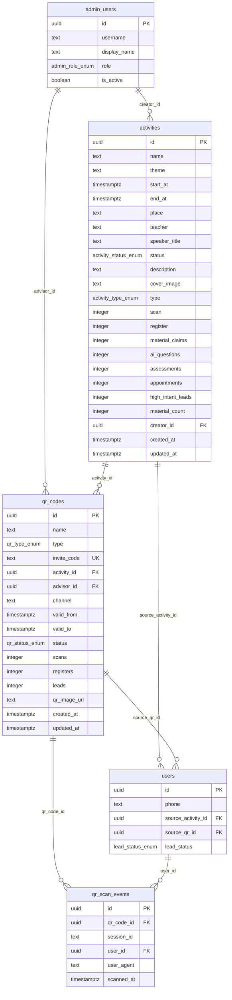

# 活动与二维码模块数据库设计

**migration 文件**：`supabase/migrations/20260610120001_create_activities_qrcodes_table.sql`
**依赖**：`20260610120000_create_users_table`
**编写日期**：2026-06-10
**关联文档**：
- `docs/api-contracts/活动管理.md`
- `docs/api-contracts/二维码管理.md`
- `docs/database/用户管理.md`

---

## 1. 实体关系



**关系说明**：

| 关系 | 类型 | 删除策略 | 说明 |
|------|------|----------|------|
| activities.creator_id → admin_users.id | N:1 | RESTRICT | 删除管理员前须先处理其创建的活动 |
| qr_codes.activity_id → activities.id | N:1 | SET NULL | 活动删除后二维码仍保留，解除关联 |
| qr_codes.advisor_id → admin_users.id | N:1 | SET NULL | 顾问删除后二维码仍保留 |
| qr_scan_events.qr_code_id → qr_codes.id | N:1 | CASCADE | 二维码删除时清除所有扫码事件 |
| qr_scan_events.user_id → users.id | N:1 | SET NULL | 用户删除后保留扫码日志，仅清除关联 |
| users.source_activity_id → activities.id | N:1 | SET NULL | 活动删除后用户来源归因置空 |
| users.source_qr_id → qr_codes.id | N:1 | SET NULL | 二维码删除后用户来源归因置空 |

---

## 2. 枚举类型

### activity_status_enum

| 值 | 说明 | 前端展示标签 |
|----|------|-------------|
| `published` | 已上架，对外开放，落地页可见 | 已上架 |
| `draft` | 草稿，未发布，仅管理员可见 | 草稿 |
| `closed` | 已下架，停止运营 | 已下架 |

### activity_type_enum

| 值 | 说明 | 前端展示标签 |
|----|------|-------------|
| `offline` | 线下活动 | 线下活动 |
| `online` | 线上直播 | 线上直播 |
| `hybrid` | 线上+线下 | 线上+线下 |

### qr_type_enum

| 值 | 说明 | 前端展示标签 |
|----|------|-------------|
| `activity` | 活动二维码，绑定活动，扫码进入活动落地页 | 活动二维码 |
| `advisor` | 顾问二维码，"新建邀请码"快捷入口使用此值 | 顾问二维码 |
| `channel` | 渠道二维码，渠道合作方分发 | 渠道二维码 |
| `material` | 资料二维码，扫码直达资料领取 | 资料二维码 |
| `assessment` | 测评二维码，扫码直达风险测评 | 测评二维码 |

### qr_status_enum

| 值 | 说明 | 前端展示标签 |
|----|------|-------------|
| `active` | 启用中，可正常扫码 | 启用中 |
| `paused` | 暂停中，扫码返回 QR_DISABLED 错误 | 暂停中 |

---

## 3. 表结构说明

### 3.1 public.activities

| 列名 | 类型 | 约束 | 说明 |
|------|------|------|------|
| id | uuid | PK, DEFAULT gen_random_uuid() | 系统主键 |
| name | text | NOT NULL, CHECK 1-200字符 | 活动名称 |
| theme | text | NOT NULL | 活动主题标签 |
| start_at | timestamptz | NOT NULL | 活动开始时间（UTC） |
| end_at | timestamptz | DEFAULT NULL, CHECK > start_at | 活动结束时间，null 表示未设置 |
| place | text | NOT NULL | 活动地点（admin 侧字段名），落地页映射为 location |
| teacher | text | NOT NULL | 主讲老师姓名（admin 侧字段名），落地页映射为 speaker |
| speaker_title | text | NOT NULL DEFAULT '' | 主讲老师职称，落地页展示 |
| status | activity_status_enum | NOT NULL DEFAULT 'draft' | 活动状态 |
| description | text | NOT NULL DEFAULT '' | 活动简介全文 |
| cover_image | text | DEFAULT NULL | 封面图 URL |
| type | activity_type_enum | DEFAULT NULL | 活动形式 |
| scan | integer | NOT NULL DEFAULT 0, CHECK >= 0 | 累计扫码人数（预存计数器） |
| register | integer | NOT NULL DEFAULT 0, CHECK >= 0 | 累计注册人数 |
| material_claims | integer | NOT NULL DEFAULT 0, CHECK >= 0 | 累计资料领取人数 |
| ai_questions | integer | NOT NULL DEFAULT 0, CHECK >= 0 | 累计 AI 问答人数 |
| assessments | integer | NOT NULL DEFAULT 0, CHECK >= 0 | 累计完成测评人数 |
| appointments | integer | NOT NULL DEFAULT 0, CHECK >= 0 | 累计预约顾问人数 |
| high_intent_leads | integer | NOT NULL DEFAULT 0, CHECK >= 0 | 高意向线索数 |
| material_count | integer | NOT NULL DEFAULT 0, CHECK >= 0 | 关联资料数（冗余计数） |
| creator_id | uuid | NOT NULL, FK → admin_users.id (RESTRICT) | 创建人 |
| created_at | timestamptz | NOT NULL DEFAULT now() | 创建时间 |
| updated_at | timestamptz | NOT NULL DEFAULT now() | 修改时间（trigger 自动更新） |

**审计修复说明**：

- `speaker_title` / `description` / `cover_image`：补全 mock 中 admin-system 缺失的三个字段，落地页已消费（mock 审计高风险项）
- `start_at` / `end_at`：替代 mock 中 `time: "2026-06-18 14:00"` 非标准字符串，落地页的 `date` / `time` 字段由后端从这两个字段格式化生成（S4）
- `teacher` / `place`：保留 admin 侧字段名，后端在落地页响应中映射为 `speaker` / `location`（S4）
- 统计计数器：预存方案，替代 mock 中 `register * 0.61` 写死系数（S6，审计不确定项 #5）
- `creator_id`：存外键 UUID，替代 mock 中 `creator: '市场运营-林琳'` 字符串（S1，审计不确定项 #3）
- `material_count`：冗余计数，关联/取消资料时同步维护，避免频繁聚合查询（审计不确定项 #6）

### 3.2 public.qr_codes

| 列名 | 类型 | 约束 | 说明 |
|------|------|------|------|
| id | uuid | PK, DEFAULT gen_random_uuid() | 系统主键，归因链唯一外键 |
| name | text | NOT NULL, CHECK 1-100字符 | 二维码名称 |
| type | qr_type_enum | NOT NULL | 二维码类型 |
| invite_code | text | NOT NULL, UNIQUE, CHECK 3-50字母数字 | 可读短码，系统生成 |
| activity_id | uuid | DEFAULT NULL, FK → activities.id (SET NULL) | 绑定活动 |
| advisor_id | uuid | DEFAULT NULL, FK → admin_users.id (SET NULL) | 绑定顾问 |
| channel | text | NOT NULL DEFAULT '' | 渠道标识 |
| valid_from | timestamptz | DEFAULT NULL | 有效期起始，null 表示无起始限制 |
| valid_to | timestamptz | DEFAULT NULL, CHECK > valid_from | 有效期截止，null 表示长期有效 |
| status | qr_status_enum | NOT NULL DEFAULT 'active' | 二维码状态 |
| scans | integer | NOT NULL DEFAULT 0, CHECK >= 0 | 累计扫码次数 |
| registers | integer | NOT NULL DEFAULT 0, CHECK >= 0 | 扫码后注册用户数 |
| leads | integer | NOT NULL DEFAULT 0, CHECK >= 0 | 归因产生线索数 |
| qr_image_url | text | DEFAULT NULL | 二维码图片 URL |
| created_at | timestamptz | NOT NULL DEFAULT now() | 创建时间 |
| updated_at | timestamptz | NOT NULL DEFAULT now() | 修改时间（trigger 自动更新） |

**审计修复说明**：

- `id`（UUID）：替代 mock 中 `QR-ACT-001` 等格式不规范主键（S2）
- `invite_code`：保留可读短码，与 `id` 并存；`id` 为系统查询键，`invite_code` 为人类可读标识（审计不确定项 #1）
- `activity_id` / `advisor_id`：外键替代 mock 中活动名称/顾问名称字符串（S1）
- `valid_from` / `valid_to`：结构化替代 mock 中 `validPeriod: "2026-06-01 至 2026-07-02"` 非结构化字符串（S2，审计不确定项 #4）
- `scans` / `registers` / `leads`：预存计数器方案（审计不确定项 #2）

### 3.3 public.qr_scan_events

| 列名 | 类型 | 约束 | 说明 |
|------|------|------|------|
| id | uuid | PK, DEFAULT gen_random_uuid() | 事件主键 |
| qr_code_id | uuid | NOT NULL, FK → qr_codes.id (CASCADE) | 来源二维码 |
| session_id | text | DEFAULT NULL | 匿名会话 id（未登录时追踪） |
| user_id | uuid | DEFAULT NULL, FK → users.id (SET NULL) | 注册用户 id，注册后回填 |
| user_agent | text | DEFAULT NULL | 用户代理（设备统计用） |
| scanned_at | timestamptz | NOT NULL DEFAULT now() | 扫码时间 |

**设计说明**：

- 无 `updated_at`：事件不可变（append-only），仅在注册后通过 `UPDATE` 回填 `user_id`
- 无 `updated_at` trigger：事件日志语义上不需要追踪字段变更时间
- `session_id`：落地页在扫码时生成匿名会话 id 存入 sessionStorage，注册前通过此字段追踪同一扫码用户的行为链

---

## 4. 约束汇总

### activities

| 约束名 | 类型 | 规则 |
|--------|------|------|
| activities_pkey | PRIMARY KEY | id |
| activities_creator_id_fk | FOREIGN KEY | creator_id → admin_users.id ON DELETE RESTRICT |
| activities_end_after_start_ck | CHECK | end_at IS NULL OR end_at > start_at |
| activities_name_length_ck | CHECK | length(trim(name)) BETWEEN 1 AND 200 |
| activities_scan_non_negative_ck | CHECK | scan >= 0 |
| activities_register_non_negative_ck | CHECK | register >= 0 |
| activities_material_claims_non_neg_ck | CHECK | material_claims >= 0 |
| activities_ai_questions_non_neg_ck | CHECK | ai_questions >= 0 |
| activities_assessments_non_neg_ck | CHECK | assessments >= 0 |
| activities_appointments_non_neg_ck | CHECK | appointments >= 0 |
| activities_high_intent_leads_non_neg_ck | CHECK | high_intent_leads >= 0 |
| activities_material_count_non_neg_ck | CHECK | material_count >= 0 |

### qr_codes

| 约束名 | 类型 | 规则 |
|--------|------|------|
| qr_codes_pkey | PRIMARY KEY | id |
| qr_codes_invite_code_uq | UNIQUE | invite_code |
| qr_codes_activity_id_fk | FOREIGN KEY | activity_id → activities.id ON DELETE SET NULL |
| qr_codes_advisor_id_fk | FOREIGN KEY | advisor_id → admin_users.id ON DELETE SET NULL |
| qr_codes_valid_period_ck | CHECK | valid_from IS NULL OR valid_to IS NULL OR valid_to > valid_from |
| qr_codes_invite_code_format_ck | CHECK | length(invite_code) BETWEEN 3 AND 50 AND invite_code ~ '^[a-zA-Z0-9_-]+$' |
| qr_codes_name_length_ck | CHECK | length(trim(name)) BETWEEN 1 AND 100 |
| qr_codes_scans_non_negative_ck | CHECK | scans >= 0 |
| qr_codes_registers_non_negative_ck | CHECK | registers >= 0 |
| qr_codes_leads_non_negative_ck | CHECK | leads >= 0 |

### qr_scan_events

| 约束名 | 类型 | 规则 |
|--------|------|------|
| qr_scan_events_pkey | PRIMARY KEY | id |
| qr_scan_events_qr_code_id_fk | FOREIGN KEY | qr_code_id → qr_codes.id ON DELETE CASCADE |
| qr_scan_events_user_id_fk | FOREIGN KEY | user_id → users.id ON DELETE SET NULL |

### users（补全的外键）

| 约束名 | 类型 | 规则 |
|--------|------|------|
| users_source_activity_id_fk | FOREIGN KEY | source_activity_id → activities.id ON DELETE SET NULL |
| users_source_qr_id_fk | FOREIGN KEY | source_qr_id → qr_codes.id ON DELETE SET NULL |

---

## 5. 索引说明

### activities 索引

| 索引名 | 类型 | 列 | 用途 |
|--------|------|----|------|
| idx_activities_status | B-Tree | status | 按状态筛选（列表页 status 筛选） |
| idx_activities_status_published | 部分 B-Tree | id WHERE status='published' | 落地页查询已上架活动，过滤大部分行 |
| idx_activities_creator_id | B-Tree | creator_id | 按创建人筛选 |
| idx_activities_start_at_desc | B-Tree | start_at DESC | 日期范围筛选及 sortBy=startAt 排序 |
| idx_activities_created_at_desc | B-Tree | created_at DESC | 默认排序（sortBy=createdAt desc） |
| idx_activities_name_trgm | GIN (pg_trgm) | name | 全文模糊搜索（q 字段 name LIKE 匹配） |
| idx_activities_teacher_trgm | GIN (pg_trgm) | teacher | 全文模糊搜索（q 字段 teacher LIKE 匹配） |

### qr_codes 索引

| 索引名 | 类型 | 列 | 用途 |
|--------|------|----|------|
| qr_codes_invite_code_uq | UNIQUE B-Tree（隐式） | invite_code | 唯一约束，支持 invite 参数查询 |
| idx_qr_codes_activity_id | 部分 B-Tree | activity_id WHERE NOT NULL | 按绑定活动筛选 |
| idx_qr_codes_advisor_id | 部分 B-Tree | advisor_id WHERE NOT NULL | 按绑定顾问筛选 |
| idx_qr_codes_status | B-Tree | status | 按状态筛选 |
| idx_qr_codes_type | B-Tree | type | 按类型筛选 |
| idx_qr_codes_created_at_desc | B-Tree | created_at DESC | 默认排序 |
| idx_qr_codes_name_trgm | GIN (pg_trgm) | name | 关键字搜索 name LIKE 匹配 |

### qr_scan_events 索引

| 索引名 | 类型 | 列 | 用途 |
|--------|------|----|------|
| idx_qr_scan_events_qr_code_id | B-Tree | qr_code_id | 按二维码查扫码事件（核心查询） |
| idx_qr_scan_events_user_id | 部分 B-Tree | user_id WHERE NOT NULL | 按用户查扫码历史（注册后回填） |
| idx_qr_scan_events_scanned_at_desc | B-Tree | scanned_at DESC | 时间排序，扫码明细列表分页 |
| idx_qr_scan_events_session_id | 部分 B-Tree | session_id WHERE NOT NULL | 按会话追踪匿名用户行为链 |

---

## 6. Trigger 说明

### activities_set_updated_at

- **表**：activities
- **触发时机**：BEFORE UPDATE FOR EACH ROW
- **执行函数**：public.set_updated_at()（migration 0 定义）
- **效果**：任意字段 UPDATE 时自动将 updated_at 设置为 now()

### qr_codes_set_updated_at

- **表**：qr_codes
- **触发时机**：BEFORE UPDATE FOR EACH ROW
- **执行函数**：public.set_updated_at()
- **效果**：同上

**注意**：qr_scan_events 无 updated_at trigger，事件记录不可变（append-only），仅允许通过 UPDATE 回填 user_id。

---

## 7. RLS 策略

### activities

| 策略名 | 操作 | USING 条件 | WITH CHECK 条件 | 适用角色 |
|--------|------|-----------|----------------|---------|
| activities_select_by_admin | SELECT | is_admin() | — | 任何已认证管理员 |
| activities_insert_by_market_ops_or_manager | INSERT | — | get_my_admin_role() IN ('market_ops','manager') | market_ops, manager |
| activities_update_by_market_ops_or_manager | UPDATE | get_my_admin_role() IN (...) | get_my_admin_role() IN (...) | market_ops, manager |
| activities_delete_by_manager | DELETE | get_my_admin_role() = 'manager' | — | manager |
| activities_select_published_by_anon | SELECT | status = 'published' | — | 匿名用户（落地页兜底） |

**注意**：落地页 API 实际使用 Service Role 绕过 RLS；`activities_select_published_by_anon` 作为安全兜底层，防止直连数据库时泄露草稿或下架活动数据。

### qr_codes

| 策略名 | 操作 | USING 条件 | WITH CHECK 条件 | 适用角色 |
|--------|------|-----------|----------------|---------|
| qr_codes_select_by_admin | SELECT | is_admin() | — | 任何已认证管理员 |
| qr_codes_insert_by_market_ops_or_manager | INSERT | — | get_my_admin_role() IN ('market_ops','manager') | market_ops, manager |
| qr_codes_update_by_market_ops_or_manager | UPDATE | get_my_admin_role() IN (...) | get_my_admin_role() IN (...) | market_ops, manager |
| qr_codes_delete_by_market_ops_or_manager | DELETE | get_my_admin_role() IN (...) | — | market_ops, manager |
| qr_codes_select_active_by_anon | SELECT | status = 'active' | — | 匿名用户（落地页扫码验证兜底） |

### qr_scan_events

| 策略名 | 操作 | USING / WITH CHECK 条件 | 适用角色 |
|--------|------|------------------------|---------|
| qr_scan_events_select_by_admin | SELECT | is_admin() | 任何已认证管理员 |
| qr_scan_events_insert_by_all | INSERT | WITH CHECK (true) | 所有人（含匿名，扫码上报公开接口） |

**user_id 回填**：注册接口由 Service Role 执行，直接 UPDATE qr_scan_events.user_id，不受 RLS 限制。

---

## 8. 扫码归因流程（S2 核心）

归因链追踪是本模块最核心的业务流程，解决 mock 审计中发现的四套标识不对齐问题。

### 8.1 完整归因流程

```
1. 生成二维码
   POST /api/admin/qr-codes
   → 系统生成 qr_codes 记录，id（UUID）和 invite_code（可读短码）

2. 生成追踪链接（服务端拼接）
   有绑定活动：https://m.example.com/?qr_id={qr_codes.id}&activity_id={activities.id}&invite={invite_code}
   无绑定活动：https://m.example.com/?qr_id={qr_codes.id}&invite={invite_code}

3. 用户扫码进入落地页
   落地页 app/page.tsx 读取 searchParams：
     qr_id       → qr_codes.id（归因主键）
     activity_id → activities.id（可选，渲染活动内容）
     invite      → invite_code（仅展示用，不做业务判断）

4. 扫码事件上报
   POST /api/track/qr-scan { qrId: qr_id, userAgent }
   服务端：
     a. 验证 qr_codes.id 存在且 status = 'active'
     b. 验证 valid_to（如不为 null，检查 <= now()）
     c. INSERT qr_scan_events { qr_code_id, session_id（前端生成）, user_agent }
     d. UPDATE qr_codes SET scans = scans + 1 WHERE id = qr_id（原子递增）
     e. UPDATE activities SET scan = scan + 1 WHERE id = activity_id（如有绑定活动）
     f. 返回绑定活动信息（QrScanTrackResponseDTO）供落地页动态渲染

5. 落地页存储归因上下文（TrackingContext）
   sessionStorage 存入：
     sourceQrId       = qr_id
     sourceActivityId = activity_id
     inviteCode       = invite
     qrValid          = true（由步骤 4 响应决定）

6. 用户注册
   POST /api/auth/login-phone { phone, sourceQrId, sourceActivityId }
   服务端：
     a. 创建/更新 users 记录：
          source_qr_id       = sourceQrId（qr_codes.id）
          source_activity_id = sourceActivityId（activities.id）
     b. UPDATE qr_codes SET registers = registers + 1（原子递增）
     c. UPDATE activities SET register = register + 1（如有绑定活动）
     d. UPDATE qr_scan_events SET user_id = users.id WHERE session_id = {sessionId}（回填 user_id）

7. 后续行为归因
   - 资料领取 → UPDATE activities SET material_claims = material_claims + 1
   - 完成测评 → UPDATE activities SET assessments = assessments + 1
   - 预约顾问 → UPDATE activities SET appointments = appointments + 1
   - 生成高意向线索 → UPDATE activities SET high_intent_leads = high_intent_leads + 1
                    + UPDATE qr_codes SET leads = leads + 1
```

### 8.2 标识体系统一（修复 mock 四套标识问题）

| 旧（mock） | 新（数据库） | 说明 |
|-----------|-------------|------|
| `qrCodeItems.id`（如 `QR-ACT-001`） | `qr_codes.id`（UUID） | 系统主键，所有外键引用此字段 |
| `qrCodeItems.inviteCode`（如 `ACT20260702`） | `qr_codes.invite_code` | 人类可读短码，URL invite 参数来源 |
| `user.sourceQr`（混用各种格式） | `users.source_qr_id`（UUID 外键） | 统一存 qr_codes.id |
| `{activity.id}-INVITE`（拼接字符串） | 废弃，由 qr_codes.invite_code 替代 | 活动管理页不再使用此拼接格式 |

### 8.3 计数器原子递增示例

```sql
-- 扫码计数（事务内执行，防止并发竞争）
UPDATE public.qr_codes
  SET scans = scans + 1
WHERE id = $1;

-- 注册计数（同一事务内）
UPDATE public.qr_codes
  SET registers = registers + 1
WHERE id = $1;

-- 活动扫码计数
UPDATE public.activities
  SET scan = scan + 1
WHERE id = $1;
```

PostgreSQL 的 `UPDATE ... SET counter = counter + 1` 在行级锁保护下是原子操作，无需额外分布式锁。高并发场景可结合 `SELECT ... FOR UPDATE SKIP LOCKED` 或消息队列批量写入。

### 8.4 定期对账

建议设置定时任务（每日低峰期），对账计数器与实际聚合值：

```sql
-- 校验 qr_codes.scans 与 qr_scan_events count 的一致性
SELECT
  q.id,
  q.scans AS stored_scans,
  COUNT(e.id) AS actual_scans,
  q.scans - COUNT(e.id) AS diff
FROM public.qr_codes q
LEFT JOIN public.qr_scan_events e ON e.qr_code_id = q.id
GROUP BY q.id, q.scans
HAVING q.scans != COUNT(e.id);
```

---

## 9. 迁移说明

### 9.1 依赖关系

本 migration 依赖 `20260610120000_create_users_table`，必须在其之后执行。原因：

- activities.creator_id 引用 admin_users.id
- qr_scan_events.user_id 引用 users.id
- 补全 users 表的两个外键约束

### 9.2 新增枚举类型

本 migration 新增 4 个枚举类型。如需在 Supabase Studio 中验证：

```sql
SELECT typname FROM pg_type
WHERE typname IN (
  'activity_status_enum', 'activity_type_enum',
  'qr_type_enum', 'qr_status_enum'
);
```

### 9.3 枚举值变更策略

PostgreSQL 枚举值只能追加，不能删除或修改。如需新增枚举值，通过新 migration 执行：

```sql
ALTER TYPE public.activity_status_enum ADD VALUE IF NOT EXISTS 'archived';
```

如需删除枚举值，需先将所有使用该值的行迁移到其他值，再通过 `pg_catalog` 操作（不推荐，风险高）。

---

## 10. 回滚方法

```sql
-- 步骤 1：移除 users 表补全的外键约束
ALTER TABLE public.users DROP CONSTRAINT IF EXISTS users_source_activity_id_fk;
ALTER TABLE public.users DROP CONSTRAINT IF EXISTS users_source_qr_id_fk;

-- 步骤 2：删表（顺序：子表先删，父表后删）
DROP TABLE IF EXISTS public.qr_scan_events CASCADE;
DROP TABLE IF EXISTS public.qr_codes CASCADE;
DROP TABLE IF EXISTS public.activities CASCADE;

-- 步骤 3：删除枚举类型（必须在依赖表删除后执行）
DROP TYPE IF EXISTS public.qr_status_enum;
DROP TYPE IF EXISTS public.qr_type_enum;
DROP TYPE IF EXISTS public.activity_type_enum;
DROP TYPE IF EXISTS public.activity_status_enum;
```

**回滚影响说明**：

- 回滚后 `users.source_activity_id` 和 `users.source_qr_id` 列仍保留（无外键约束），与 migration 0 的原始状态一致
- `DROP TABLE ... CASCADE` 会同时删除所有索引、触发器、RLS 策略
- 回滚不影响 migration 0 的内容（admin_users / users / 枚举 / 函数）
- 如有其他 migration 依赖本次新增的表，需先回滚那些 migration

---

## 11. 本地验证方法

### 11.1 验证表和枚举创建成功

```sql
-- 验证枚举类型
SELECT typname, array_agg(enumlabel ORDER BY enumsortorder) AS values
FROM pg_enum e
JOIN pg_type t ON t.oid = e.enumtypid
WHERE typname IN (
  'activity_status_enum', 'activity_type_enum',
  'qr_type_enum', 'qr_status_enum'
)
GROUP BY typname;

-- 验证表存在
SELECT tablename FROM pg_tables
WHERE schemaname = 'public'
AND tablename IN ('activities', 'qr_codes', 'qr_scan_events');

-- 验证外键约束（含 users 表补全的两个外键）
SELECT conname, conrelid::regclass, confrelid::regclass
FROM pg_constraint
WHERE contype = 'f'
AND conrelid::regclass::text IN ('activities', 'qr_codes', 'qr_scan_events', 'users')
ORDER BY conrelid::regclass, conname;
```

### 11.2 验证 RLS 策略

```sql
-- 验证 RLS 已启用
SELECT tablename, rowsecurity
FROM pg_tables
WHERE schemaname = 'public'
AND tablename IN ('activities', 'qr_codes', 'qr_scan_events');

-- 验证 RLS 策略数量
SELECT tablename, COUNT(*) AS policy_count
FROM pg_policies
WHERE schemaname = 'public'
AND tablename IN ('activities', 'qr_codes', 'qr_scan_events')
GROUP BY tablename;
```

### 11.3 验证索引

```sql
SELECT indexname, tablename, indexdef
FROM pg_indexes
WHERE schemaname = 'public'
AND tablename IN ('activities', 'qr_codes', 'qr_scan_events')
ORDER BY tablename, indexname;
```

### 11.4 验证 Trigger

```sql
SELECT trigger_name, event_object_table, action_timing, event_manipulation
FROM information_schema.triggers
WHERE trigger_schema = 'public'
AND event_object_table IN ('activities', 'qr_codes')
ORDER BY event_object_table, trigger_name;
```

### 11.5 验证 CHECK 约束

```sql
-- 尝试插入违规数据（应报错）
INSERT INTO public.activities (
  name, theme, start_at, end_at, place, teacher, creator_id
) VALUES (
  '测试活动', '测试', now(), now() - interval '1 hour',  -- end_at < start_at，应触发 CHECK 错误
  '上海', '王老师', 'a0000000-0000-0000-0000-000000000001'::uuid
);
-- 预期：ERROR: new row for relation "activities" violates check constraint "activities_end_after_start_ck"
```

### 11.6 验证 seed 数据

```sql
-- 验证 seed 活动数据
SELECT id, name, status, creator_id FROM public.activities;

-- 验证 seed 二维码数据（含外键关联）
SELECT
  q.id,
  q.name,
  q.invite_code,
  q.type,
  a.name AS activity_name,
  au.display_name AS advisor_name
FROM public.qr_codes q
LEFT JOIN public.activities a ON a.id = q.activity_id
LEFT JOIN public.admin_users au ON au.id = q.advisor_id;

-- 验证 users 表外键补全
SELECT conname FROM pg_constraint
WHERE conname IN ('users_source_activity_id_fk', 'users_source_qr_id_fk');
```

### 11.7 验证 updated_at trigger

```sql
-- 更新一条记录，验证 updated_at 自动变化
UPDATE public.activities
  SET name = name  -- 无实质内容改变，仅触发 trigger
WHERE id = 'c0000000-0000-0000-0000-000000000001';

SELECT id, updated_at FROM public.activities
WHERE id = 'c0000000-0000-0000-0000-000000000001';
-- 预期：updated_at 更新为当前时间
```
