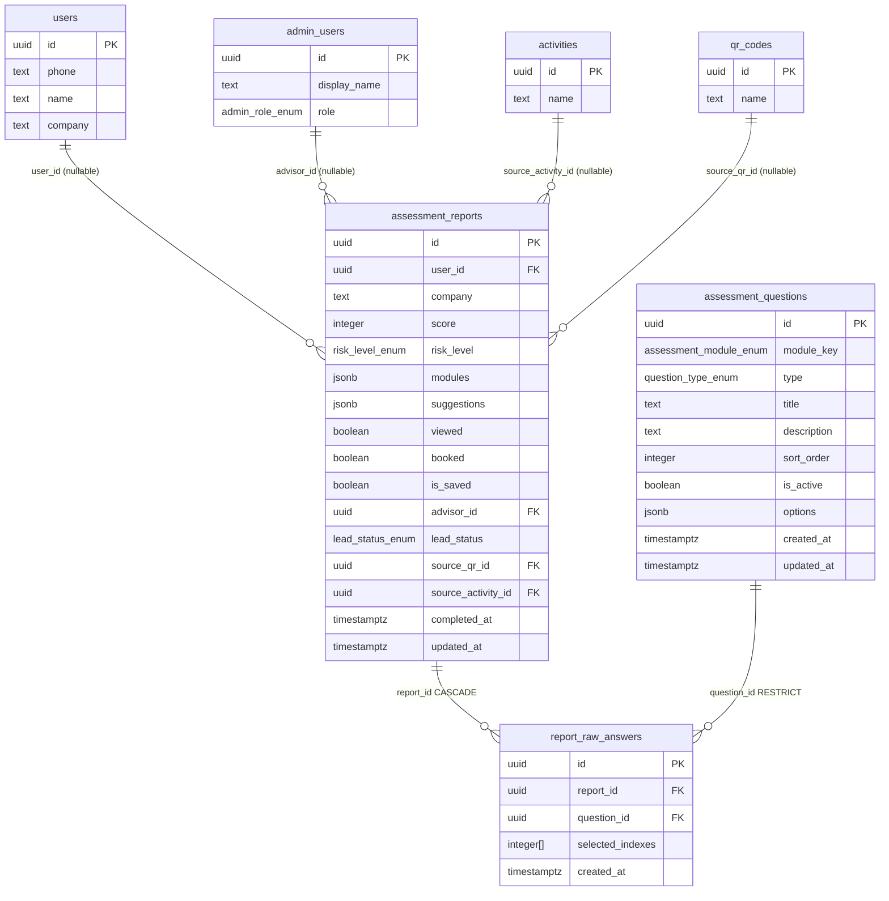

# 测评报告模块数据库设计文档

**Migration 文件**：`supabase/migrations/20260610120004_create_assessment_table.sql`  
**依赖 Migration**：`20260610120001_create_activities_qrcodes_table`  
**编写日期**：2026-06-10  
**关联文档**：
- `docs/api-contracts/测评报告.md`
- `docs/mock-audit/测评报告-mock-audit.md`
- `docs/database/用户管理.md`（users / admin_users 表）
- `docs/database/活动与二维码.md`（activities / qr_codes 表）

---

## 1. 实体关系（ER 图）



---

## 2. 枚举类型

### question_type_enum

题目类型，对应落地页答题页的渲染逻辑。

| 值 | 含义 |
|----|------|
| `single` | 单选题：只能选一项 |
| `multiple` | 多选题：可选多项 |
| `range` | 区间选择：以单选形式表达数量范围 |

### assessment_module_enum

题库模块（8 个维度），对应落地页硬编码题库的 `module` 字段。

| 值 | 中文标签 |
|----|---------|
| `company_basic` | 企业基础信息 |
| `invoice_compliance` | 发票合规风险 |
| `fund_transfer` | 公转私风险 |
| `income_tax` | 所得税风险 |
| `vat` | 增值税风险 |
| `payroll_insurance` | 个税社保风险 |
| `cost_expense` | 成本费用风险 |
| `tax_audit` | 税务稽查应对 |

### report_module_enum

报告展示模块（5 个维度），对应落地页报告页的模块卡片。

| 值 | 中文标签 |
|----|---------|
| `report_invoice` | 发票合规风险 |
| `report_fund` | 公转私风险 |
| `report_cost` | 成本费用风险 |
| `report_payroll` | 个税社保风险 |
| `report_audit` | 税务稽查应对风险 |

### risk_level_enum

风险等级（本 migration 中定义，供 assessment_reports 及后续模块复用）。

| 值 | 含义 | 对应 Mock 中文值 |
|----|------|----------------|
| `low` | 低风险 | `低风险` |
| `medium` | 中风险 | `中风险` |
| `high` | 高风险 | `高风险` |
| `critical` | 严重风险 | `严重风险` |

---

## 3. 题库模块 → 报告模块映射关系

服务端在计算报告评分时按如下映射将题库模块的题目得分聚合到报告模块。

| 题库模块 (`assessment_module_enum`) | 报告模块 (`report_module_enum`) | 说明 |
|-------------------------------------|--------------------------------|------|
| `invoice_compliance` | `report_invoice` | 直接映射 |
| `fund_transfer` | `report_fund` | 直接映射 |
| `income_tax` | `report_cost` | 与 cost_expense 合并计算 |
| `cost_expense` | `report_cost` | 与 income_tax 合并计算 |
| `payroll_insurance` | `report_payroll` | 直接映射 |
| `tax_audit` | `report_audit` | 直接映射 |
| `company_basic` | —（综合评分） | 用于综合分计算，不单独出模块卡片 |
| `vat` | —（综合评分） | 用于综合分计算，不单独出模块卡片 |

注：此映射关系在产品最终确认前为草稿（见 API 契约遗留不确定项 #1），实现时须以产品确认版为准。

---

## 4. 表结构说明

### 4.1 public.assessment_questions

存储测评题库，替代落地页 `risk-assessment-quiz-page.tsx` 中的硬编码 `questions` 数组。

| 列 | 类型 | 可空 | 默认值 | 说明 |
|----|------|------|--------|------|
| `id` | `uuid` | NOT NULL | `gen_random_uuid()` | 主键 |
| `module_key` | `assessment_module_enum` | NOT NULL | — | 所属题库模块（8 维度） |
| `type` | `question_type_enum` | NOT NULL | — | 题目类型 |
| `title` | `text` | NOT NULL | — | 题目标题，不允许空字符串 |
| `description` | `text` | NOT NULL | `''` | 题目补充说明，允许空字符串 |
| `sort_order` | `integer` | NOT NULL | — | 全局唯一排序序号（1 起始） |
| `is_active` | `boolean` | NOT NULL | `true` | 是否启用；false 时落地页不返回该题 |
| `options` | `jsonb` | NOT NULL | `'[]'` | 选项数组（见 §5 JSONB 格式说明） |
| `created_at` | `timestamptz` | NOT NULL | `now()` | 创建时间（UTC） |
| `updated_at` | `timestamptz` | NOT NULL | `now()` | 更新时间（UTC），由 trigger 维护 |

**约束**：
- `PRIMARY KEY (id)`
- `UNIQUE (sort_order)` — 全局排序不冲突
- `CHECK (sort_order > 0)` — 排序从 1 起始
- `CHECK (length(trim(title)) > 0)` — 标题不为空字符串
- `CHECK (jsonb_typeof(options) = 'array')` — options 必须是 JSON 数组

### 4.2 public.assessment_reports

存储每次测评结果的完整快照，是测评模块的核心表。

| 列 | 类型 | 可空 | 默认值 | 说明 |
|----|------|------|--------|------|
| `id` | `uuid` | NOT NULL | `gen_random_uuid()` | 主键（S5：服务端生成） |
| `user_id` | `uuid` | NULL | `NULL` | 用户外键；null 表示匿名测评 |
| `company` | `text` | NOT NULL | `''` | 企业名称快照（创建时复制，保留历史） |
| `score` | `integer` | NOT NULL | — | 综合风险分 0-100（S5：服务端计算） |
| `risk_level` | `risk_level_enum` | NOT NULL | — | 风险等级（S5：服务端计算） |
| `modules` | `jsonb` | NOT NULL | `'[]'` | ModuleScoreDTO[] 数组（见 §5） |
| `suggestions` | `jsonb` | NOT NULL | `'[]'` | 整改建议 string[] 数组 |
| `viewed` | `boolean` | NOT NULL | `false` | 用户是否已解锁完整报告 |
| `booked` | `boolean` | NOT NULL | `false` | 用户是否已预约顾问 |
| `is_saved` | `boolean` | NOT NULL | `false` | 用户是否已保存到"我的报告" |
| `advisor_id` | `uuid` | NULL | `NULL` | 分配顾问外键；null 表示未分配 |
| `lead_status` | `lead_status_enum` | NOT NULL | `'none'` | 线索状态冗余字段 |
| `source_qr_id` | `uuid` | NULL | `NULL` | 来源二维码归因 |
| `source_activity_id` | `uuid` | NULL | `NULL` | 来源活动归因 |
| `completed_at` | `timestamptz` | NOT NULL | `now()` | 测评完成时间（UTC） |
| `updated_at` | `timestamptz` | NOT NULL | `now()` | 更新时间（UTC），由 trigger 维护 |

**约束**：
- `PRIMARY KEY (id)`
- `CHECK (score BETWEEN 0 AND 100)` — 分值范围
- `CHECK (jsonb_typeof(modules) = 'array')` — modules 必须是 JSON 数组
- `CHECK (jsonb_typeof(suggestions) = 'array')` — suggestions 必须是 JSON 数组

**外键与删除策略**：

| 外键列 | 目标表 | 删除策略 | 说明 |
|--------|--------|---------|------|
| `user_id` | `public.users(id)` | `SET NULL` | 用户删除时报告保留，user_id 置 null |
| `advisor_id` | `public.admin_users(id)` | `SET NULL` | 顾问账号删除时报告保留，advisor_id 置 null |
| `source_qr_id` | `public.qr_codes(id)` | `SET NULL` | 二维码删除时归因置 null，报告保留 |
| `source_activity_id` | `public.activities(id)` | `SET NULL` | 活动删除时归因置 null，报告保留 |

### 4.3 public.report_raw_answers

存储每份报告每道题的原始答题记录，每道题一行。

| 列 | 类型 | 可空 | 默认值 | 说明 |
|----|------|------|--------|------|
| `id` | `uuid` | NOT NULL | `gen_random_uuid()` | 主键 |
| `report_id` | `uuid` | NOT NULL | — | 所属报告外键（CASCADE） |
| `question_id` | `uuid` | NOT NULL | — | 所属题目外键（RESTRICT） |
| `selected_indexes` | `integer[]` | NOT NULL | `'{}'` | 所选选项的 sort_order 索引数组 |
| `created_at` | `timestamptz` | NOT NULL | `now()` | 创建时间（UTC） |

**约束**：
- `PRIMARY KEY (id)`
- `UNIQUE (report_id, question_id)` — 每份报告每道题只有一条记录（幂等写入）

**外键与删除策略**：

| 外键列 | 目标表 | 删除策略 | 说明 |
|--------|--------|---------|------|
| `report_id` | `public.assessment_reports(id)` | `CASCADE` | 报告删除时所有答题记录同步删除 |
| `question_id` | `public.assessment_questions(id)` | `RESTRICT` | 题目不能在有关联答题记录时被删除 |

无 `updated_at`：答题记录一经创建不可修改（数据完整性保障）。

---

## 5. JSONB 字段格式说明

### 5.1 assessment_questions.options

选项数组，每项包含排序索引、展示文字和评分权重。

```json
[
  { "sort_order": 0, "label": "1 年以内", "score": 5 },
  { "sort_order": 1, "label": "1–3 年",   "score": 3 },
  { "sort_order": 2, "label": "3 年以上",  "score": 0 }
]
```

| 字段 | 类型 | 说明 |
|------|------|------|
| `sort_order` | `integer` | 选项排序（0 起始）；前端提交 `selectedIndexes` 时传此值 |
| `label` | `string` | 选项展示文字（落地页渲染） |
| `score` | `integer` | 评分权重（S5：仅服务端使用，落地页 API 返回时过滤此字段） |

多选题与单选题格式相同，差异在于前端选中的 `sort_order` 可以是多个。

### 5.2 assessment_reports.modules

报告模块评分数组，对应 `ModuleScoreDTO[]`。

```json
[
  {
    "module_key":   "report_invoice",
    "module_name":  "发票合规风险",
    "score":        68,
    "risk_level":   "high",
    "desc":         "企业存在大量现金收款未开票情形，发票合规风险较高。",
    "advice":       "建议梳理开票流程，规范发票管理，减少无票收入比例。"
  },
  {
    "module_key":   "report_fund",
    "module_name":  "公转私风险",
    "score":        80,
    "risk_level":   "high",
    "desc":         "频繁发生大额公转私转账，缺乏合规凭证支撑。",
    "advice":       "建议通过合法薪酬或股东分红渠道取现，留存完整凭证。"
  }
]
```

| 字段 | 类型 | 说明 |
|------|------|------|
| `module_key` | `report_module_enum` 值 | 报告模块标识（5 个维度） |
| `module_name` | `string` | 中文展示名称（服务端填充） |
| `score` | `integer` | 该模块风险分 0-100（服务端计算） |
| `risk_level` | `risk_level_enum` 值 | 该模块风险等级（服务端计算） |
| `desc` | `string` | 风险说明（服务端生成） |
| `advice` | `string` | 初步建议（服务端生成） |

### 5.3 assessment_reports.suggestions

整改建议字符串数组，直接存 `string[]`。

```json
[
  "建议优先整改公转私问题，留存资金往来合规凭证。",
  "尽快补齐发票缺口，规范开票流程。",
  "建议与税务顾问预约深度诊断，制定整改路线图。"
]
```

未解锁用户（`viewed = false`）通过 `GET /api/assessment/report/:id` 获取报告时，API 层不返回 `suggestions` 字段（返回 `undefined`，而非空数组）。

---

## 6. S5 安全约束说明

本模块的安全设计对应 API 契约 §8 的五条安全约定。

### 6.1 选项 score 权重不暴露给落地页

`assessment_questions.options` 字段包含 `score` 权重，但落地页公开接口 `GET /api/assessment/questions` 的服务端实现在查询后、返回前必须过滤掉每个选项的 `score` 字段，仅返回 `{ sort_order, label }`（`QuestionOptionPublicDTO`）。

RLS 层无法做字段级过滤，此安全控制完全由 API 层（Server Action / Route Handler）负责。

### 6.2 为何 report_raw_answers 不存 score

`report_raw_answers.selected_indexes` 只存选项的 `sort_order` 索引数组，不存对应的 `score` 值。原因：

- 若将答题时的 `score` 也一并落库，则任何能读取答题记录的人（包括有 SELECT 权限的管理员）都可以通过 `答题记录.score` × `选项数量` 反推出各题目的评分权重，进而推算出哪条路径能获得最高分（或最低分）。
- 服务端若需要重新验证或重算分数，只需用 `question_id` JOIN `assessment_questions.options`，按 `sort_order` 匹配取 `score`，无需历史快照中存储权重。

### 6.3 报告 score 不接受前端传入

提交答题的 API 入参类型 `AssessmentSubmitDTO` 中不含 `score` 和 `riskLevel` 字段。服务端在事务中完成：

1. 读取 `assessment_questions.options` 中的 `score` 权重
2. 按题目 → 答题记录 → 选项 score 累加
3. 归一化到 0-100
4. 按产品阈值映射 `risk_level`
5. 将计算结果写入 `assessment_reports` 并返回 `reportId`

API 层必须对请求体做严格的 schema 验证（zod），拒绝任何包含 `score` 或 `riskLevel` 的提交。

### 6.4 报告页通过 reportId 获取报告

落地页报告页（`app/risk-assessment/report/page.tsx`）必须通过 `reportId` 调用 `GET /api/assessment/report/:id` 获取报告，绝不从 URL `?score=` 参数读取分数（替代当前 mock 中 `searchParams.get("score")` 的实现）。

### 6.5 解锁 / 保存状态后端落库

- `POST /api/assessment/report/:id/unlock` 将 `viewed` 设为 `true` 后落库
- `POST /api/assessment/report/:id/save` 将 `is_saved` 设为 `true` 后落库

两个操作均不依赖前端 local state，刷新页面后状态由数据库保持。

---

## 7. 索引说明

### assessment_questions

| 索引名 | 列 | 类型 | 用途 |
|--------|-----|------|------|
| `assessment_questions_pkey` | `id` | B-Tree（主键） | 主键查找 |
| `assessment_questions_sort_order_uq` | `sort_order` | B-Tree（UNIQUE） | 排序唯一性；落地页按 sort_order 排序取题 |
| `idx_assessment_questions_module_key` | `module_key` | B-Tree | 按模块筛选题目；服务端评分时按模块读题 |
| `idx_assessment_questions_active` | `sort_order` WHERE `is_active=true` | 部分索引 | 落地页 `GET /api/assessment/questions` 只取启用题目 |

### assessment_reports

| 索引名 | 列 | 类型 | 用途 |
|--------|-----|------|------|
| `assessment_reports_pkey` | `id` | B-Tree（主键） | 主键查找（报告详情 / 答题认领） |
| `idx_assessment_reports_user_id` | `user_id` WHERE NOT NULL | 部分索引 | 查询某用户的所有报告；排除匿名报告减小索引体积 |
| `idx_assessment_reports_risk_level` | `risk_level` | B-Tree | 风险等级筛选；`highRiskCount` 统计 |
| `idx_assessment_reports_viewed` | `viewed` | B-Tree | 已查看/未查看筛选；`viewedCount` 统计 |
| `idx_assessment_reports_booked` | `booked` | B-Tree | 已预约/未预约筛选；`bookedCount` 统计 |
| `idx_assessment_reports_lead_status` | `lead_status` | B-Tree | 线索状态精确筛选 |
| `idx_assessment_reports_completed_at` | `completed_at DESC` | B-Tree | 默认排序（sortBy=completedAt）；时间范围筛选 |
| `idx_assessment_reports_score` | `score DESC` | B-Tree | 按风险分排序（sortBy=score） |
| `idx_assessment_reports_advisor_id` | `advisor_id` WHERE NOT NULL | 部分索引 | 查询某顾问分配的报告；排除未分配报告 |

### report_raw_answers

| 索引名 | 列 | 类型 | 用途 |
|--------|-----|------|------|
| `report_raw_answers_pkey` | `id` | B-Tree（主键） | 主键查找 |
| `report_raw_answers_report_question_uq` | `(report_id, question_id)` | B-Tree（UNIQUE） | 唯一约束 + 覆盖"查某报告所有答题"查询 |
| `idx_report_raw_answers_question_id` | `question_id` | B-Tree | 统计某道题的答题分布；题库分析 |

---

## 8. RLS 策略

### assessment_questions

| 策略名 | 操作 | 条件 | 用途 |
|--------|------|------|------|
| `assessment_questions_select_active` | SELECT | `is_active = true` | 落地页公开题库（任何人包括匿名） |
| `assessment_questions_select_by_manager` | SELECT | `get_my_admin_role() = 'manager'` | 管理员查看含 score 的完整题库 |
| `assessment_questions_insert_by_manager` | INSERT | `get_my_admin_role() = 'manager'` | 管理员新增题目 |
| `assessment_questions_update_by_manager` | UPDATE | `get_my_admin_role() = 'manager'` | 管理员修改题目 |

DELETE 未开放给业务层（RLS 无 DELETE 策略）；软下线通过 `is_active=false` 实现；Service Role 保留硬删除能力供迁移使用。

注意：`assessment_questions_select_active` 和 `assessment_questions_select_by_manager` 同时存在时，PostgreSQL 对同一操作的多条 PERMISSIVE 策略取 OR 关系。已认证为 manager 的用户两条策略都满足，可见全部题目（含停用题目）。落地页匿名用户仅满足第一条，只能查到 `is_active=true` 的题目。

### assessment_reports

| 策略名 | 操作 | 条件 | 用途 |
|--------|------|------|------|
| `assessment_reports_select_self` | SELECT | `auth.uid() = user_id` | 端用户查看自己的报告 |
| `assessment_reports_insert_self` | INSERT | `user_id = auth.uid()` 或两者均为 null | 端用户提交测评（含匿名） |
| `assessment_reports_update_self` | UPDATE | `auth.uid() = user_id` | 端用户解锁/保存/认领报告 |
| `assessment_reports_select_by_admin` | SELECT | `is_admin()` | 管理员查看所有报告 |
| `assessment_reports_update_by_ops_or_manager` | UPDATE | `get_my_admin_role() IN ('market_ops', 'manager')` | 运营/管理员分配顾问、更新线索状态 |

`tax_advisor` 仅有 SELECT 权限（通过 `assessment_reports_select_by_admin` 策略），无 UPDATE 权限。

匿名报告（`user_id IS NULL`）认领（claim）操作：服务端通过 Service Role 执行 UPDATE，将 `user_id` 从 null 改为已登录用户的 UUID；此操作绕过 RLS，由 API 层在验证 token 后执行。

### report_raw_answers

| 策略名 | 操作 | 条件 | 用途 |
|--------|------|------|------|
| `report_raw_answers_select_self` | SELECT | `report_id` 属于 `auth.uid()` 的报告 | 端用户查看自己的答题记录 |
| `report_raw_answers_insert_self` | INSERT | `report_id` 属于 `auth.uid()` 的报告或匿名报告 | 端用户提交答题时写入 |
| `report_raw_answers_select_by_admin` | SELECT | `is_admin()` | 管理员查看答题明细 |

任何角色不能通过业务 API UPDATE 或 DELETE 答题记录（无对应 RLS 策略）。

---

## 9. 报告评分流程

提交答题到报告入库的完整服务端处理链路：

```
前端提交 POST /api/assessment/submit
  请求体：AssessmentSubmitDTO
    { userId?, answers: [{ questionId, selectedIndexes }], sourceQrId?, sourceActivityId? }
          |
          v
  1. 验证请求体（zod schema，拒绝含 score/riskLevel 的请求）
          |
          v
  2. 查询题库：
     SELECT id, module_key, options
     FROM assessment_questions
     WHERE id = ANY(答题中的 questionId 列表)
       AND is_active = true
          |
          v
  3. 服务端计算各题得分：
     对每道题：
       用 selectedIndexes 从 options JSONB 中找到对应 sort_order 的选项
       累加选中选项的 score 值 → 该题原始得分
          |
          v
  4. 按题库模块 → 报告模块映射聚合：
     company_basic + vat → 综合分权重
     invoice_compliance  → report_invoice 模块分
     fund_transfer       → report_fund 模块分
     income_tax + cost_expense → report_cost 模块分
     payroll_insurance   → report_payroll 模块分
     tax_audit           → report_audit 模块分
     各模块原始分归一化到 0-100
          |
          v
  5. 计算综合风险分：
     各模块分加权求和后归一化 → score（0-100 整数）
          |
          v
  6. 映射风险等级（阈值由产品最终确认）：
     score >= 85 → critical
     score >= 65 → high
     score >= 35 → medium
     score < 35  → low
          |
          v
  7. 生成模块评分对象（ModuleScoreDTO[]）：
     每个报告模块填充：module_key / module_name / score / risk_level / desc / advice
          |
          v
  8. 生成整改建议（suggestions string[]）：
     根据高风险模块和答题模式生成建议列表
          |
          v
  9. 开启数据库事务：
     a. INSERT INTO assessment_reports
        (id, user_id, company, score, risk_level, modules, suggestions,
         source_qr_id, source_activity_id)
     b. INSERT INTO report_raw_answers
        (report_id, question_id, selected_indexes) × N 道题
        ON CONFLICT (report_id, question_id) DO NOTHING  — 幂等
     提交事务
          |
          v
  10. 返回 AssessmentSubmitResponseDTO：
      { reportId, score, riskLevel, modules }
      前端用 reportId 跳转报告页（替代 URL ?score= 方案，S5）
```

---

## 10. 迁移方案

本模块从零新建，无已有表需要迁移。落地页和管理后台的 Mock 数据迁移说明如下：

### 落地页迁移点

| Mock 来源 | 迁移方式 |
|-----------|---------|
| `risk-assessment-quiz-page.tsx` 硬编码 `questions` 数组（15 道题） | 通过管理员题库管理接口入库，或直接执行 seed SQL |
| `report/page.tsx` 硬编码 `modules` 数组 | 改为 `GET /api/assessment/report/:id` 获取 |
| `report/page.tsx` URL `?score=` 参数 | 改为 `reportId` 路由参数，从 API 获取报告 |
| `isUnlocked` / `isSaved` 前端 state | 改为调用 unlock / save API，从 API 返回状态 |

### 管理后台迁移点

| Mock 来源 | 迁移方式 |
|-----------|---------|
| `lib/mock-data.ts` `reports` 数组 | 改为 `GET /api/admin/reports`（分页 + 筛选） |
| `report.user` 姓名关联 | 改为 `userId` 外键 + JOIN 查询 `userName` |
| `modules: string[]` | 改为 `ModuleScoreDTO[]`（含 score / riskLevel / desc / advice） |
| `advisor` 姓名字符串 | 改为 `advisorId` 外键 + JOIN 查询 `advisorName` |

---

## 11. 回滚方法

在确认备份存在后，按以下顺序执行（顺序不可颠倒）：

```sql
-- 步骤 1：删除答题记录表
-- CASCADE 同时删除该表上的索引、trigger 和 RLS 策略
DROP TABLE IF EXISTS public.report_raw_answers CASCADE;

-- 步骤 2：删除报告表
DROP TABLE IF EXISTS public.assessment_reports CASCADE;

-- 步骤 3：删除题库表
DROP TABLE IF EXISTS public.assessment_questions CASCADE;

-- 步骤 4：删除枚举类型（必须在依赖该类型的表删除后执行）
DROP TYPE IF EXISTS public.risk_level_enum;
DROP TYPE IF EXISTS public.report_module_enum;
DROP TYPE IF EXISTS public.assessment_module_enum;
DROP TYPE IF EXISTS public.question_type_enum;
```

注意：
- 若 `risk_level_enum` 已被后续 migration 中的其他表引用，需先移除依赖列再删除枚举。
- 回滚后落地页答题功能将降级为 Mock 模式（硬编码题库 + 纯前端计算），需确认前端有兜底 fallback。
- 生产环境回滚前必须通知相关团队，确认业务可接受短暂降级。

---

## 12. 本地验证方法

以下验证方法均在本地 Supabase 开发环境执行，不操作生产数据库。

### 12.1 确认表和枚举已创建

```sql
-- 确认枚举
SELECT typname FROM pg_type
WHERE typname IN (
  'question_type_enum', 'assessment_module_enum',
  'report_module_enum', 'risk_level_enum'
)
ORDER BY typname;
-- 期望返回 4 行

-- 确认表
SELECT tablename FROM pg_tables
WHERE schemaname = 'public'
  AND tablename IN (
    'assessment_questions', 'assessment_reports', 'report_raw_answers'
  )
ORDER BY tablename;
-- 期望返回 3 行
```

### 12.2 确认约束

```sql
-- assessment_questions 约束
SELECT conname, contype, consrc
FROM pg_constraint
WHERE conrelid = 'public.assessment_questions'::regclass
ORDER BY conname;

-- assessment_reports 约束
SELECT conname, contype, consrc
FROM pg_constraint
WHERE conrelid = 'public.assessment_reports'::regclass
ORDER BY conname;
```

### 12.3 确认外键

```sql
-- assessment_reports 的所有外键
SELECT
  kcu.column_name,
  ccu.table_name  AS foreign_table,
  ccu.column_name AS foreign_column,
  rc.delete_rule
FROM information_schema.table_constraints AS tc
JOIN information_schema.key_column_usage AS kcu
  ON tc.constraint_name = kcu.constraint_name
JOIN information_schema.constraint_column_usage AS ccu
  ON ccu.constraint_name = tc.constraint_name
JOIN information_schema.referential_constraints AS rc
  ON rc.constraint_name = tc.constraint_name
WHERE tc.table_name = 'assessment_reports'
  AND tc.constraint_type = 'FOREIGN KEY';
-- 期望：user_id→users(SET NULL), advisor_id→admin_users(SET NULL),
--       source_qr_id→qr_codes(SET NULL), source_activity_id→activities(SET NULL)
```

### 12.4 确认索引

```sql
SELECT indexname, indexdef
FROM pg_indexes
WHERE tablename IN (
  'assessment_questions', 'assessment_reports', 'report_raw_answers'
)
ORDER BY tablename, indexname;
```

### 12.5 确认 RLS 已启用

```sql
SELECT tablename, rowsecurity
FROM pg_tables
WHERE schemaname = 'public'
  AND tablename IN (
    'assessment_questions', 'assessment_reports', 'report_raw_answers'
  );
-- 期望：三张表的 rowsecurity 均为 true
```

### 12.6 确认 RLS 策略

```sql
SELECT tablename, policyname, cmd, qual
FROM pg_policies
WHERE tablename IN (
  'assessment_questions', 'assessment_reports', 'report_raw_answers'
)
ORDER BY tablename, policyname;
-- 期望：assessment_questions 4 条，assessment_reports 5 条，report_raw_answers 3 条
```

### 12.7 确认 trigger

```sql
SELECT trigger_name, event_manipulation, event_object_table
FROM information_schema.triggers
WHERE event_object_schema = 'public'
  AND event_object_table IN ('assessment_questions', 'assessment_reports')
ORDER BY event_object_table, trigger_name;
-- 期望：每张表各有一条 BEFORE UPDATE trigger
```

### 12.8 验证 seed 数据

```sql
-- 确认题库 seed
SELECT id, module_key, title, sort_order, is_active,
       jsonb_array_length(options) AS option_count
FROM public.assessment_questions
ORDER BY sort_order;
-- 期望：3 行，sort_order 1/2/3，各有 3 或 4 个选项

-- 确认报告 seed
SELECT id, user_id, company, score, risk_level, lead_status,
       viewed, booked, is_saved
FROM public.assessment_reports
WHERE id = 'r0000000-0000-0000-0000-000000000001';
-- 期望：score=72, risk_level=high, viewed=false, lead_status=new

-- 确认答题记录 seed
SELECT ra.id, ra.question_id, ra.selected_indexes,
       q.title
FROM public.report_raw_answers ra
JOIN public.assessment_questions q ON q.id = ra.question_id
WHERE ra.report_id = 'r0000000-0000-0000-0000-000000000001'
ORDER BY q.sort_order;
-- 期望：3 行，分别对应 sort_order 1/2/3 的题目

-- 验证幂等写入（重复插入不报错）
INSERT INTO public.report_raw_answers (id, report_id, question_id, selected_indexes)
VALUES (
  'a0000000-0000-0000-0001-000000000001'::uuid,
  'r0000000-0000-0000-0000-000000000001'::uuid,
  'q0000000-0000-0000-0000-000000000001'::uuid,
  ARRAY[1]
)
ON CONFLICT (report_id, question_id) DO NOTHING;
-- 期望：INSERT 0 0（不报错，不插入重复行）
```

### 12.9 验证 RESTRICT 外键保护

```sql
-- 尝试删除有关联答题记录的题目，应报错
DELETE FROM public.assessment_questions
WHERE id = 'q0000000-0000-0000-0000-000000000001';
-- 期望：ERROR: update or delete on table "assessment_questions" violates foreign key constraint
```

### 12.10 验证 score 范围约束

```sql
-- 尝试插入 score 超出范围的报告，应报错
INSERT INTO public.assessment_reports (user_id, company, score, risk_level)
VALUES (NULL, '测试', 101, 'low');
-- 期望：ERROR: new row for relation "assessment_reports" violates check constraint
```
