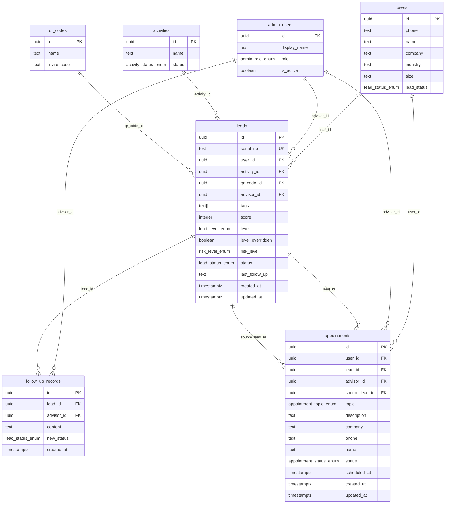

# 线索管理模块数据库设计文档

**版本**：v1.0.0  
**编写日期**：2026-06-10  
**Migration 文件**：`supabase/migrations/20260610120003_create_leads_table.sql`  
**依赖 Migration**：`20260610120001_create_activities_qrcodes_table`  

---

## 1. 实体关系图



---

## 2. 表结构说明

### 2.1 public.leads — 线索主表

| 列 | 类型 | 可空 | 默认值 | 说明 |
|----|------|------|--------|------|
| `id` | `uuid` | NOT NULL | `gen_random_uuid()` | UUID 主键，API 路由键 |
| `serial_no` | `text` | NOT NULL | `''`（trigger 填充） | 展示编号 `L{YYYYMMDD}{3位序号}`，全局唯一 |
| `user_id` | `uuid` | NOT NULL | — | 关联端用户外键（S1） |
| `activity_id` | `uuid` | NULL | NULL | 来源活动外键（S1），可空 |
| `qr_code_id` | `uuid` | NULL | NULL | 来源二维码外键（S1），可空 |
| `advisor_id` | `uuid` | NULL | NULL | 分配顾问外键（S1），可空 |
| `tags` | `text[]` | NOT NULL | `'{}'` | 需求标签数组，最多 30 个 |
| `score` | `integer` | NOT NULL | `0` | 意向分，服务端计算，≥ 0 |
| `level` | `lead_level_enum` | NOT NULL | `'normal'` | 意向等级，服务端按 score 自动计算 |
| `level_overridden` | `boolean` | NOT NULL | `false` | true = 人工覆写，score 变更不再自动更新 level |
| `risk_level` | `text` | NULL | NULL | 冗余自测评报告，null = 未完成测评；暂为 text + CHECK，待 migration 4 后升级为 `risk_level_enum` |
| `status` | `lead_status_enum` | NOT NULL | `'new'` | 线索状态，受状态机约束 |
| `last_follow_up` | `text` | NULL | NULL | 最新跟进记录前 50 字冗余缓存 |
| `created_at` | `timestamptz` | NOT NULL | `now()` | 创建时间（UTC） |
| `updated_at` | `timestamptz` | NOT NULL | `now()` | 最近修改时间（UTC），trigger 自动更新 |

**约束**：

| 约束名 | 类型 | 定义 |
|--------|------|------|
| `leads_pkey` | PRIMARY KEY | `(id)` |
| `leads_serial_no_uq` | UNIQUE | `(serial_no)` |
| `leads_user_id_fk` | FOREIGN KEY | `user_id → users(id) ON DELETE RESTRICT` |
| `leads_activity_id_fk` | FOREIGN KEY | `activity_id → activities(id) ON DELETE SET NULL` |
| `leads_qr_code_id_fk` | FOREIGN KEY | `qr_code_id → qr_codes(id) ON DELETE SET NULL` |
| `leads_advisor_id_fk` | FOREIGN KEY | `advisor_id → admin_users(id) ON DELETE SET NULL` |
| `leads_score_non_negative_ck` | CHECK | `score >= 0` |
| `leads_risk_level_ck` | CHECK | `risk_level IN ('low', 'medium', 'high', 'critical') OR risk_level IS NULL` |
| `leads_tags_count_ck` | CHECK | `array_length(tags, 1) IS NULL OR array_length(tags, 1) <= 30` |

---

### 2.2 public.follow_up_records — 跟进记录

| 列 | 类型 | 可空 | 默认值 | 说明 |
|----|------|------|--------|------|
| `id` | `uuid` | NOT NULL | `gen_random_uuid()` | UUID 主键 |
| `lead_id` | `uuid` | NOT NULL | — | 归属线索外键（CASCADE 删除） |
| `advisor_id` | `uuid` | NOT NULL | — | 操作人外键（RESTRICT 删除） |
| `content` | `text` | NOT NULL | — | 跟进内容正文，不允许空白 |
| `new_status` | `lead_status_enum` | NULL | NULL | 本次跟进后的状态变更，null = 未变更 |
| `created_at` | `timestamptz` | NOT NULL | `now()` | 跟进时间（UTC），不可变 |

无 `updated_at`：记录追加后不可修改（append-only 设计）。

**约束**：

| 约束名 | 类型 | 定义 |
|--------|------|------|
| `follow_up_records_pkey` | PRIMARY KEY | `(id)` |
| `follow_up_records_lead_id_fk` | FOREIGN KEY | `lead_id → leads(id) ON DELETE CASCADE` |
| `follow_up_records_advisor_id_fk` | FOREIGN KEY | `advisor_id → admin_users(id) ON DELETE RESTRICT` |
| `follow_up_records_content_not_blank_ck` | CHECK | `length(trim(content)) > 0` |

---

### 2.3 public.appointments — 预约记录

| 列 | 类型 | 可空 | 默认值 | 说明 |
|----|------|------|--------|------|
| `id` | `uuid` | NOT NULL | `gen_random_uuid()` | UUID 主键 |
| `user_id` | `uuid` | NOT NULL | — | 关联端用户外键（RESTRICT） |
| `lead_id` | `uuid` | NULL | NULL | 关联线索外键（SET NULL），服务端填充 |
| `advisor_id` | `uuid` | NULL | NULL | 分配顾问外键（SET NULL），可空 |
| `topic` | `appointment_topic_enum` | NOT NULL | — | 咨询主题枚举 |
| `description` | `text` | NOT NULL | — | 问题描述，不允许空白 |
| `company` | `text` | NULL | NULL | 企业名称（冗余字段），可空 |
| `industry` | `text` | NULL | NULL | 行业，可空 |
| `contact_time` | `text` | NULL | NULL | 方便联系时间（自由文本），可空 |
| `wechat` | `text` | NULL | NULL | 微信号，可空 |
| `upload_intent` | `text` | NULL | NULL | 是否愿意上传资料（意向信号），可空 |
| `phone` | `text` | NOT NULL | — | 提交时手机号（冗余，11 位中国大陆格式） |
| `name` | `text` | NOT NULL | — | 提交时姓名（冗余，不允许空白） |
| `status` | `appointment_status_enum` | NOT NULL | `'pending'` | 预约状态 |
| `scheduled_at` | `timestamptz` | NULL | NULL | 顾问确认的联系时间（UTC），可空 |
| `source_lead_id` | `uuid` | NULL | NULL | 前端传入的来源线索 id，可空 |
| `created_at` | `timestamptz` | NOT NULL | `now()` | 提交时间（UTC） |
| `updated_at` | `timestamptz` | NOT NULL | `now()` | 最近修改时间（UTC），trigger 自动更新 |

**约束**：

| 约束名 | 类型 | 定义 |
|--------|------|------|
| `appointments_pkey` | PRIMARY KEY | `(id)` |
| `appointments_user_id_fk` | FOREIGN KEY | `user_id → users(id) ON DELETE RESTRICT` |
| `appointments_lead_id_fk` | FOREIGN KEY | `lead_id → leads(id) ON DELETE SET NULL` |
| `appointments_advisor_id_fk` | FOREIGN KEY | `advisor_id → admin_users(id) ON DELETE SET NULL` |
| `appointments_source_lead_id_fk` | FOREIGN KEY | `source_lead_id → leads(id) ON DELETE SET NULL` |
| `appointments_phone_ck` | CHECK | `phone ~ '^1[0-9]{10}$'` |
| `appointments_description_not_blank_ck` | CHECK | `length(trim(description)) > 0` |
| `appointments_name_not_blank_ck` | CHECK | `length(trim(name)) > 0` |

---

## 3. 枚举类型

### 3.1 risk_level_enum（风险等级）

`risk_level_enum` 定义于 `20260610120004_create_assessment_table`（非本 migration）。  
`leads.risk_level` 列在本 migration 中暂以 `text + CHECK` 约束实现（语义等价）。  
待 migration 4 执行后，可通过新 migration 将列类型升级为枚举：

```sql
ALTER TABLE public.leads
  ALTER COLUMN risk_level TYPE public.risk_level_enum
    USING risk_level::public.risk_level_enum;
```

| 值 | 中文展示 |
|----|---------|
| `low` | 低风险 |
| `medium` | 中风险 |
| `high` | 高风险 |
| `critical` | 严重风险 |

### 3.2 lead_level_enum（意向等级）

| 值 | 中文展示 | score 阈值 |
|----|---------|-----------|
| `strong` | 强意向线索 | score ≥ 100 |
| `high` | 高意向线索 | score ≥ 70 |
| `potential` | 潜在线索 | score ≥ 40 |
| `normal` | 普通用户 | score < 40 |

### 3.3 lead_status_enum（线索状态，定义于 migration 0）

```
none ─── (User.lead_status 专用值，不出现在 leads 表)

new ──► pending ──► assigned ──► following ──► appointed ──► converted
 │                      │             │              │
 └──────────────────────┴─────────────┴──────────────┴──► invalid
```

| 值 | 中文展示 | 可操作角色 |
|----|---------|-----------|
| `new` | 新线索 | 系统自动 / market_ops / manager |
| `pending` | 待跟进 | market_ops / manager |
| `assigned` | 已分配 | market_ops / manager |
| `following` | 跟进中 | tax_advisor / manager |
| `appointed` | 已预约 | 预约提交时系统自动联动 |
| `converted` | 已成交 | tax_advisor / manager |
| `invalid` | 无效线索 | market_ops / manager |

**终态约束**：`converted` 和 `invalid` 不允许再转换到其他状态（API 层强制校验）。

### 3.4 appointment_status_enum（预约状态）

```
pending ──► confirmed ──► completed
   │              │
   └──────────────┴──► cancelled
```

| 值 | 中文展示 |
|----|---------|
| `pending` | 待联系 |
| `confirmed` | 已确认 |
| `completed` | 已完成 |
| `cancelled` | 已取消 |

### 3.5 appointment_topic_enum（咨询主题）

| 值 | 中文展示 |
|----|---------|
| `tax_risk_check` | 税务风险排查 |
| `invoice_compliance` | 发票合规 |
| `public_to_private_risk` | 公转私风险 |
| `corporate_income_tax` | 企业所得税筹划 |
| `individual_tax_social` | 个税社保合规 |
| `tax_audit_response` | 税务稽查应对 |
| `company_structure` | 公司架构设计 |
| `other` | 其他问题 |

与落地页 `lib/contracts/appointment.ts AppointmentTopic` 和管理后台 `lib/contracts/lead.ts AppointmentTopic` 保持同步，任何新增值需三端同步更新。

---

## 4. 索引说明

### 4.1 leads 索引

| 索引名 | 列 | 类型 | 用途 |
|--------|----|------|------|
| `idx_leads_user_id` | `user_id` | B-Tree | 查某用户的所有线索 |
| `idx_leads_advisor_id` | `advisor_id` WHERE NOT NULL | B-Tree（部分） | 按分配顾问筛选 |
| `idx_leads_activity_id` | `activity_id` WHERE NOT NULL | B-Tree（部分） | 按来源活动筛选 |
| `idx_leads_qr_code_id` | `qr_code_id` WHERE NOT NULL | B-Tree（部分） | 按来源二维码筛选 |
| `idx_leads_status` | `status` | B-Tree | Tab 切换状态筛选 |
| `idx_leads_level` | `level` | B-Tree | 意向等级筛选 |
| `idx_leads_score_desc` | `score DESC` | B-Tree | 按意向分排序 |
| `idx_leads_created_at_desc` | `created_at DESC` | B-Tree | 默认排序，分页稳定性 |
| `idx_leads_updated_at_desc` | `updated_at DESC` | B-Tree | 按更新时间排序 |
| `idx_leads_tags_gin` | `tags` | GIN | 标签包含查询（`@>`） |
| `idx_leads_risk_level` | `risk_level` WHERE NOT NULL | B-Tree（部分） | 风险等级筛选 |

### 4.2 follow_up_records 索引

| 索引名 | 列 | 类型 | 用途 |
|--------|----|------|------|
| `idx_follow_up_records_lead_id_created_at` | `(lead_id, created_at DESC)` | B-Tree（复合） | 查某线索跟进记录（分页） |
| `idx_follow_up_records_advisor_id` | `advisor_id` | B-Tree | 查某顾问跟进记录 |
| `idx_follow_up_records_created_at_desc` | `created_at DESC` | B-Tree | 时间线倒序排列 |

### 4.3 appointments 索引

| 索引名 | 列 | 类型 | 用途 |
|--------|----|------|------|
| `idx_appointments_user_id` | `user_id` | B-Tree | 查某用户预约（落地页"我的预约"） |
| `idx_appointments_lead_id` | `lead_id` WHERE NOT NULL | B-Tree（部分） | 线索详情预约卡片 |
| `idx_appointments_advisor_id` | `advisor_id` WHERE NOT NULL | B-Tree（部分） | 按顾问筛选预约 |
| `idx_appointments_status` | `status` | B-Tree | 预约状态筛选 |
| `idx_appointments_created_at_desc` | `created_at DESC` | B-Tree | 默认排序 |

---

## 5. RLS 策略

### 5.1 leads

| 策略名 | 操作 | USING / WITH CHECK | 覆盖角色 |
|--------|------|--------------------|---------|
| `leads_select_by_admin` | SELECT | `is_admin()` | 所有管理员角色（含 tax_advisor） |
| `leads_select_advisor_own` | SELECT | `get_my_admin_role() = 'tax_advisor' AND advisor_id = auth.uid()` | tax_advisor（直连兜底） |
| `leads_insert_by_market_ops_or_manager` | INSERT | `get_my_admin_role() IN ('market_ops', 'manager')` | market_ops / manager |
| `leads_update_by_market_ops_or_manager` | UPDATE | `get_my_admin_role() IN ('market_ops', 'manager')` | market_ops / manager |
| `leads_update_by_tax_advisor_own` | UPDATE | `get_my_admin_role() = 'tax_advisor' AND advisor_id = auth.uid()` | tax_advisor |
| `leads_delete_by_manager` | DELETE | `get_my_admin_role() = 'manager'` | manager |

**tax_advisor SELECT 说明**：`leads_select_by_admin` 已覆盖所有活跃管理员（含 tax_advisor），因此 tax_advisor 在 RLS 层可读所有线索行。业务层（API Handler）需额外限制 tax_advisor 只能查 `advisor_id = auth.uid()` 的数据，RLS 层的 `leads_select_advisor_own` 作为直连 Supabase 客户端场景的安全兜底。

### 5.2 follow_up_records

| 策略名 | 操作 | USING / WITH CHECK | 说明 |
|--------|------|--------------------|------|
| `follow_up_records_select_by_admin` | SELECT | `is_admin()` | 所有管理员可读 |
| `follow_up_records_insert_by_advisor_or_manager` | INSERT | `get_my_admin_role() IN ('tax_advisor', 'manager')` | market_ops 无权添加 |
| （无 UPDATE 策略） | UPDATE | — | 默认拒绝，记录不可变 |
| （无 DELETE 策略） | DELETE | — | 默认拒绝，记录不可变 |

### 5.3 appointments

| 策略名 | 操作 | USING / WITH CHECK | 说明 |
|--------|------|--------------------|------|
| `appointments_select_self` | SELECT | `auth.uid() = user_id` | 端用户只读自己的预约 |
| `appointments_insert_self` | INSERT | `auth.uid() = user_id` | 端用户只能创建自己的预约 |
| `appointments_select_by_admin` | SELECT | `is_admin()` | 管理员读取所有预约 |
| `appointments_update_by_advisor_or_manager` | UPDATE | `get_my_admin_role() IN ('tax_advisor', 'manager')` | 顾问/管理者更新预约状态 |

**Service Role** 绕过所有 RLS，用于：预约提交后自动关联/创建 Lead、更新 `leads.status`、更新 `leads.last_follow_up` 摘要缓存。

---

## 6. serial_no 生成机制

`serial_no` 由 BEFORE INSERT 触发器 `leads_generate_serial_no` 调用 `public.generate_lead_serial_no()` 函数生成。

**生成规则**：

```
serial_no = 'L' + to_char(now() AT TIME ZONE 'Asia/Shanghai', 'YYYYMMDD') + lpad(seq, 3, '0')
```

- 前缀 `L` + 8 位日期（北京时间）+ 3 位当日序号（001、002...）
- 序号 = 当日已有 `serial_no LIKE 'L{YYYYMMDD}%'` 的记录数 + 1
- 触发条件：`serial_no = '' OR serial_no IS NULL`（仅首次 INSERT 时生效，不覆盖已有值）
- UNIQUE 约束保证全局唯一，并发极低冲突概率时数据库自动报错并重试

**示例**：

| 当日第 N 条线索 | serial_no |
|----------------|-----------|
| 第 1 条 | `L20260610001` |
| 第 10 条 | `L20260610010` |
| 第 1000 条 | `L20260610999`（超出 3 位后自动扩展为 4 位） |

**并发注意**：当前实现使用 `COUNT(*)+1`，极端并发（同毫秒多条插入）可能产生重复序号，由 UNIQUE 约束拦截并让业务层重试。如业务量增大，可改为 `advisory lock` 或独立序列表方案。

---

## 7. 预约与线索联动流程

### 7.1 落地页用户提交预约（POST /api/appointments）

```
用户提交 AppointmentCreateDTO
      │
      ▼
服务端（Service Role）
      │
      ├─► 从 JWT 解析 user_id
      │
      ├─► 查询 users.lead_status
      │       │
      │       ├─ 'none'（无线索）
      │       │     └─► 创建新 Lead（status='appointed'）→ 获取 lead_id
      │       │
      │       └─ 其他（有线索）
      │             └─► 查找该用户最新激活线索
      │                   └─► 若 status 不是 'appointed'/'converted'
      │                         → UPDATE leads.status = 'appointed'
      │
      ├─► 创建 Appointment 记录，填入 lead_id
      │
      ├─► UPDATE activities.appointments += 1（若 source_activity_id 存在）
      │
      └─► 返回 AppointmentCreateResponseDTO { id, leadId, status, createdAt }
```

### 7.2 顾问更新预约状态（PATCH /api/admin/appointments/:id/status）

```
顾问提交 AppointmentStatusUpdateDTO { status, note? }
      │
      ▼
服务端（Service Role）
      │
      ├─► 校验状态机合法转换（API 层）
      │
      ├─► UPDATE appointments.status, scheduled_at（若 confirmed）
      │
      └─► （可选）若 status = 'completed'，服务端可联动更新
            leads.status = 'converted'（由业务逻辑决定，非自动）
```

### 7.3 意向分更新触发 level 自动计算

```
leads.score 发生变更时（UPDATE）
      │
      ▼
服务端业务层
      │
      ├─ 若 level_overridden = false
      │     └─► 按阈值重新计算 level：
      │           score >= 100 → 'strong'
      │           score >= 70  → 'high'
      │           score >= 40  → 'potential'
      │           score < 40   → 'normal'
      │
      └─ 若 level_overridden = true
            └─► level 保持不变，score 仍正常更新
```

---

## 8. 外键删除策略汇总

| 表 | 外键列 | 引用表 | 删除策略 | 原因 |
|----|--------|--------|---------|------|
| `leads` | `user_id` | `users` | RESTRICT | 用户删除前须先处理其线索，防止孤立记录 |
| `leads` | `activity_id` | `activities` | SET NULL | 活动删除后线索保留历史记录，仅解除来源关联 |
| `leads` | `qr_code_id` | `qr_codes` | SET NULL | 二维码删除后线索保留，仅解除来源关联 |
| `leads` | `advisor_id` | `admin_users` | SET NULL | 顾问账号删除后线索保留，仅解除分配 |
| `follow_up_records` | `lead_id` | `leads` | CASCADE | 线索删除时跟进历史无保留价值，一并清理 |
| `follow_up_records` | `advisor_id` | `admin_users` | RESTRICT | 顾问删除前须先处理其跟进记录 |
| `appointments` | `user_id` | `users` | RESTRICT | 用户删除前须先处理其预约，防止孤立记录 |
| `appointments` | `lead_id` | `leads` | SET NULL | 线索删除后预约历史记录保留 |
| `appointments` | `advisor_id` | `admin_users` | SET NULL | 顾问删除后预约保留，仅解除顾问关联 |
| `appointments` | `source_lead_id` | `leads` | SET NULL | 来源线索删除后预约保留 |

---

## 9. 迁移说明

### 9.1 Mock 修复对应关系

| Mock 问题 | 修复方案 |
|----------|---------|
| `leads.id` 格式为 `L20260605001`（日期编码进 id） | `id` 改为 UUID，展示编号独立为 `serial_no` 字段 |
| `leads.activity` 存活动名称字符串 | 改为 `activity_id` 外键（S1） |
| `leads.qr` 混用 inviteCode 和 id | 改为 `qr_code_id` 外键（S1） |
| `leads.advisor` 存顾问姓名字符串 | 改为 `advisor_id` 外键（S1） |
| `leads.risk` 独立设置，与测评报告不联动 | `risk_level` 冗余自 `assessment_reports`，由服务端写入 |
| 无独立 `FollowUpRecord` 实体，历史记录丢失 | 新增 `follow_up_records` 表（append-only） |
| 落地页预约提交仅 `setSubmitted(true)`，不落库 | `appointments` 表承接真实落库 |
| 预约与线索无联动 | 预约提交时服务端自动更新 `leads.status = 'appointed'` |

### 9.2 前端迁移要点

- 线索列表路由参数由 `id`（`L20260605001` 格式）改为 UUID，`serialNo` 仅用于展示
- 顾问筛选下拉从硬编码改为 `GET /api/admin/leads/filter-options` 动态加载
- 标签筛选下拉同上，从所有线索 `tags` 字段聚合
- 意向分构成 4 项进度条从硬编码改为 `GET /api/admin/leads/:id` 中的 `scoreBreakdown.dimensions`
- 行为路径时间线从全局 `userTimeline` 改为 `GET /api/admin/leads/:id` 中的 `timeline`（按 userId 过滤）

---

## 10. 回滚方法

在本地环境执行（严禁在生产环境执行）：

```sql
-- 步骤 1：删除表（按依赖顺序，CASCADE 同时删除索引、触发器、RLS 策略）
DROP TABLE IF EXISTS public.appointments CASCADE;
DROP TABLE IF EXISTS public.follow_up_records CASCADE;
DROP TABLE IF EXISTS public.leads CASCADE;

-- 步骤 2：删除触发器函数
DROP FUNCTION IF EXISTS public.generate_lead_serial_no();

-- 步骤 3：删除枚举类型（确认无其他 migration 依赖后执行）
DROP TYPE IF EXISTS public.appointment_topic_enum;
DROP TYPE IF EXISTS public.appointment_status_enum;
DROP TYPE IF EXISTS public.lead_level_enum;
DROP TYPE IF EXISTS public.risk_level_enum;
```

**注意**：
- `risk_level_enum` 将被后续 `assessment_reports` 模块引用，回滚前需确认该 migration 尚未执行。
- 回滚后 `migration 0-2` 创建的内容不受影响。
- 生产环境的破坏性变更必须通过新 migration 实现，不执行此回滚脚本。

---

## 11. 本地验证方法

### 11.1 检查表和枚举是否创建成功

```sql
-- 检查枚举类型
SELECT typname FROM pg_type
WHERE typname IN ('risk_level_enum', 'lead_level_enum', 'appointment_status_enum', 'appointment_topic_enum')
ORDER BY typname;

-- 检查表存在
SELECT tablename FROM pg_tables
WHERE schemaname = 'public'
  AND tablename IN ('leads', 'follow_up_records', 'appointments')
ORDER BY tablename;
```

### 11.2 验证 serial_no 触发器

```sql
-- 插入不含 serial_no 的线索，触发器应自动生成
INSERT INTO public.leads (user_id, status)
VALUES ('b0000000-0000-0000-0000-000000000003'::uuid, 'new')
RETURNING id, serial_no, created_at;
-- 预期：serial_no 为 L{当日日期}{序号}，如 L20260610003
```

### 11.3 验证 RLS 策略

```sql
-- 以管理员 JWT 连接，验证可读所有线索
SELECT count(*) FROM public.leads;  -- 应返回 2（seed 数据）

-- 验证 follow_up_records 无法 UPDATE（RLS 默认拒绝）
UPDATE public.follow_up_records
SET content = '篡改内容'
WHERE id = 'f0000000-0000-0000-0000-000000000001'::uuid;
-- 预期：0 rows affected（RLS 拒绝，不报错）
```

### 11.4 验证外键约束

```sql
-- 验证 RESTRICT：尝试删除有线索的用户，应报错
DELETE FROM public.users
WHERE id = 'b0000000-0000-0000-0000-000000000001'::uuid;
-- 预期：ERROR: update or delete on table "users" violates foreign key constraint

-- 验证 CASCADE：删除线索时跟进记录一并删除
DELETE FROM public.leads
WHERE id = 'e0000000-0000-0000-0000-000000000001'::uuid;
SELECT count(*) FROM public.follow_up_records
WHERE lead_id = 'e0000000-0000-0000-0000-000000000001'::uuid;
-- 预期：0
```

### 11.5 验证 Check Constraint

```sql
-- 验证 phone 格式约束
INSERT INTO public.appointments (user_id, topic, description, phone, name)
VALUES (
  'b0000000-0000-0000-0000-000000000002'::uuid,
  'other', '测试', '1234567890', '测试'
);
-- 预期：ERROR: new row for relation "appointments" violates check constraint "appointments_phone_ck"

-- 验证 content 不允许空白
INSERT INTO public.follow_up_records (lead_id, advisor_id, content)
VALUES (
  'e0000000-0000-0000-0000-000000000002'::uuid,
  'a0000000-0000-0000-0000-000000000003'::uuid,
  '   '
);
-- 预期：ERROR: violates check constraint "follow_up_records_content_not_blank_ck"
```

### 11.6 验证 seed 数据

```sql
SELECT id, serial_no, status, level, score FROM public.leads ORDER BY serial_no;
SELECT id, lead_id, advisor_id, left(content, 20) AS content_preview FROM public.follow_up_records;
SELECT id, user_id, lead_id, topic, status FROM public.appointments;
```
