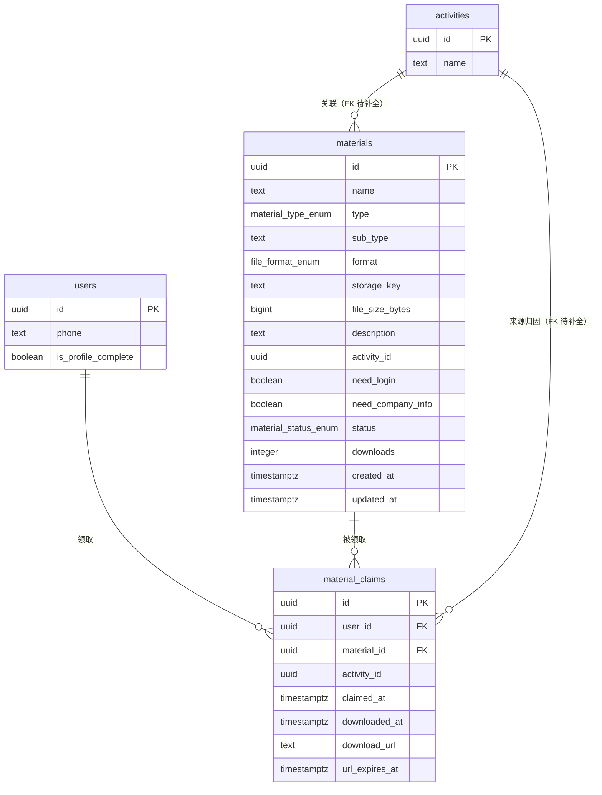

# 资料管理模块数据库设计文档

**版本**：v1.0.0
**编写日期**：2026-06-10
**Migration 文件**：`supabase/migrations/20260610120002_create_materials_table.sql`
**依赖 Migration**：`20260610120000_create_users_table`
**关联文档**：
- `docs/mock-audit/资料管理-mock-audit.md`
- `docs/api-contracts/资料管理.md`
- `docs/database/用户管理.md`

---

## 1. 实体关系



**关系说明**：

- `users` 1:N `material_claims`：一个用户可以领取多个资料，每个领取记录对应一个用户。
- `materials` 1:N `material_claims`：一个资料可以被多个用户领取，每条领取记录对应一个资料。
- `(user_id, material_id)` UNIQUE：每个用户对每个资料只能领取一次（幂等约束）。
- `materials.activity_id` 和 `material_claims.activity_id` 指向 `activities.id`，FK constraint 待 `20260610120001_create_activities_qrcodes_table` 执行后由新 migration 补全。

---

## 2. 枚举类型

### 2.1 material_type_enum — 资料类型

| 枚举值 | admin 中文标签 | 落地页 Tab 标签 | 说明 |
|--------|--------------|---------------|------|
| `courseware` | 沙龙课件 | 沙龙课件 | 活动相关课件、PPT |
| `policy` | 政策资料 | 政策解读 | 税收政策文件、解读材料 |
| `checklist` | 工具表 | 自查表 | 自查清单、核查工具 |
| `case` | 案例资料 | 案例资料 | 脱敏真实案例、分析报告 |

审计修复（S4）：废弃 admin mock 中文值（沙龙课件/政策资料/工具表/案例资料），统一为英文枚举；废弃 landing mock 的数字类型枚举；两端展示标签通过常量映射处理（`MATERIAL_TYPE_LABEL`、`MATERIAL_TYPE_TAB_LABEL`）。

### 2.2 file_format_enum — 文件格式

| 枚举值 | 展示标签 | 说明 |
|--------|---------|------|
| `pdf` | PDF | PDF 文档 |
| `xlsx` | Excel | Excel 电子表格 |
| `pptx` | PPT | PowerPoint 演示文稿 |
| `docx` | Word | Word 文档 |

审计修复（S4）：废弃 mock 中"XLSX" vs "Excel"歧义，统一为小写枚举值；落地页 mock 缺少 `pptx`/`docx` 格式，统一为四种格式覆盖所有场景。

### 2.3 material_status_enum — 资料上架状态

| 枚举值 | 中文展示 | 说明 |
|--------|---------|------|
| `published` | 已上架 | 落地页可见、可领取 |
| `draft` | 草稿 | 仅管理员可见，落地页不可见 |
| `unpublished` | 已下架 | 不可领取；admin 可查询 |

审计修复（S4）：这是资料的上架状态，与下文的 `MaterialClaimStatus`（领取状态）完全不同语义。原 mock 两端同用 `status` 字段但含义不同，高风险冲突已通过重命名彻底解决。

### 2.4 MaterialClaimStatus — 领取状态（API 层推导，非数据库字段）

此状态不存储在数据库中，由 API 层根据以下四个条件实时推导后返回给落地页：

| 推导输入 | 推导结果 | 说明 |
|---------|---------|------|
| `material_claims` 记录存在（`user_id` + `material_id` 匹配） | `claimed` | 已领取 |
| `material_claims` 无记录 且 `need_company_info=true` 且 `is_profile_complete=false` | `needs_company_info` | 需要补充企业信息（隐含未登录或已登录但未填企业信息） |
| `material_claims` 无记录 且 `need_login=true` 且 用户未登录 | `needs_login` | 需要先登录 |
| 以上均不满足 | `available` | 可直接领取 |

推导优先级：`claimed` > `needs_company_info` > `needs_login` > `available`。

推导涉及的数据库字段：`materials.need_login`、`materials.need_company_info`、`material_claims`（是否存在对应记录）、`users.is_profile_complete`（企业信息是否完整）。

审计修复（S4）：原 landing mock 的 `status` 字段混用上架状态和领取状态，接入真实 API 后极易产生 Bug。通过将领取状态重命名为 `MaterialClaimStatus` 并移至 API 层推导，彻底消除同名异义风险。

---

## 3. 表结构说明

### 3.1 public.materials

| 字段 | 类型 | 默认值 | 可空 | 说明 |
|------|------|--------|------|------|
| `id` | `uuid` | `gen_random_uuid()` | NOT NULL | 主键，UUID v4 |
| `name` | `text` | — | NOT NULL | 资料名称，1-200 字符 |
| `type` | `material_type_enum` | — | NOT NULL | 资料大分类 |
| `sub_type` | `text` | NULL | 可空 | 细分类型标签（自由字符串），如"课程课件"、"答疑整理" |
| `format` | `file_format_enum` | — | NOT NULL | 文件格式 |
| `storage_key` | `text` | — | NOT NULL | Supabase Storage 对象 key，不含完整 URL |
| `file_size_bytes` | `bigint` | NULL | 可空 | 文件大小（字节数），旧数据迁移时允许缺失 |
| `description` | `text` | NULL | 可空 | 资料描述，落地页卡片展示用 |
| `activity_id` | `uuid` | NULL | 可空 | 关联活动 UUID；FK 待补全 |
| `need_login` | `boolean` | `false` | NOT NULL | 是否需要登录才能领取 |
| `need_company_info` | `boolean` | `false` | NOT NULL | 是否需要补充企业信息才能领取 |
| `status` | `material_status_enum` | `'draft'` | NOT NULL | 上架状态，新建默认草稿 |
| `downloads` | `integer` | `0` | NOT NULL | 实际文件下载次数，由 trigger 维护 |
| `created_at` | `timestamptz` | `now()` | NOT NULL | 创建时间（UTC） |
| `updated_at` | `timestamptz` | `now()` | NOT NULL | 最近修改时间（UTC），trigger 维护 |

**约束汇总**：

| 约束名 | 类型 | 规则 | 业务含义 |
|--------|------|------|---------|
| `materials_pkey` | PRIMARY KEY | `id` | 主键唯一 |
| `materials_name_length_ck` | CHECK | `length(trim(name)) BETWEEN 1 AND 200` | 资料名称 1-200 字符，不允许纯空格 |
| `materials_downloads_non_negative_ck` | CHECK | `downloads >= 0` | 下载次数不允许为负 |
| `materials_file_size_positive_ck` | CHECK | `file_size_bytes IS NULL OR file_size_bytes > 0` | 文件大小若不为 null 则必须大于 0 |
| `materials_auth_gate_hierarchy_ck` | CHECK | `NOT (need_company_info = true AND need_login = false)` | 门槛层级约束：企业信息门槛隐含登录门槛 |

**字段设计说明**：

- `storage_key` 存 Supabase Storage 对象 key（如 `materials/2026/06/filename.pdf`），不存完整 URL。signed URL 由 API 层在需要时生成，有效期由服务端控制。
- `downloads` 字段仅由 trigger `material_claims_increment_downloads` 递增，不允许 API 直接写入，保证与 `material_claims.downloaded_at` 的原子一致性。
- 领取次数（claims）不单独落字段，通过 `COUNT(material_claims WHERE material_id=?)` 聚合查询获取，避免双写不一致。`MaterialSummaryDTO.totalClaims` 由统计接口汇总计算。
- `sub_type` 和 `type` 共存：`type` 是大分类枚举（固定 4 值），`sub_type` 是细分标签（自由字符串），对应审计不确定项 #1 的设计决策。

### 3.2 public.material_claims

| 字段 | 类型 | 默认值 | 可空 | 说明 |
|------|------|--------|------|------|
| `id` | `uuid` | `gen_random_uuid()` | NOT NULL | 主键，UUID v4 |
| `user_id` | `uuid` | — | NOT NULL | 端用户外键，ON DELETE CASCADE |
| `material_id` | `uuid` | — | NOT NULL | 资料外键，ON DELETE CASCADE |
| `activity_id` | `uuid` | NULL | 可空 | 来源活动 UUID（S2 归因链）；FK 待补全 |
| `claimed_at` | `timestamptz` | `now()` | NOT NULL | 领取时间（UTC） |
| `downloaded_at` | `timestamptz` | NULL | 可空 | 实际下载时间（UTC）；null 表示已领取未下载 |
| `download_url` | `text` | NULL | 可空 | 缓存的 signed 下载 URL，有效期短 |
| `url_expires_at` | `timestamptz` | NULL | 可空 | download_url 的过期时间（UTC） |

**约束汇总**：

| 约束名 | 类型 | 规则 | 业务含义 |
|--------|------|------|---------|
| `material_claims_pkey` | PRIMARY KEY | `id` | 主键唯一 |
| `material_claims_user_material_uq` | UNIQUE | `(user_id, material_id)` | 幂等保护：每用户每资料只能领取一次 |
| `material_claims_download_after_claim_ck` | CHECK | `downloaded_at IS NULL OR downloaded_at >= claimed_at` | 下载时间不能早于领取时间 |
| `fk_material_claims_user` | FK | `user_id → public.users(id) ON DELETE CASCADE` | 用户删除时级联删除领取记录 |
| `fk_material_claims_material` | FK | `material_id → public.materials(id) ON DELETE CASCADE` | 资料删除时级联删除相关领取记录 |

**无 `updated_at` 的设计说明**：

领取记录遵循"追加不修改"原则，只有 `downloaded_at` 会在用户实际下载时被 UPDATE。通用的 `updated_at` trigger 对此表语义不清晰，故不添加。`downloaded_at` 字段本身即记录了最后一次有意义的状态变更时间。

**外键删除策略说明**：

- `user_id ON DELETE CASCADE`：用户账号注销时，其领取记录随之物理删除。若业务需要保留领取记录用于统计（即使用户已注销），需调整为 `ON DELETE SET NULL` 并将 `user_id` 改为可空——当前阶段不作此调整，待产品确认用户注销政策后通过新 migration 处理。
- `material_id ON DELETE CASCADE`：资料被物理删除时，相关领取记录随之删除。API 层须在允许删除资料前先将其下架（`status='unpublished'`）并通知相关用户；物理删除为最终操作。

---

## 4. 索引说明

### 4.1 materials 索引

| 索引名 | 类型 | 字段 | 条件 | 用途 |
|--------|------|------|------|------|
| `materials_pkey` | B-Tree（隐式） | `id` | — | 主键查找 |
| `idx_materials_type` | B-Tree | `type` | — | 按资料类型筛选（MaterialQueryDTO.type） |
| `idx_materials_status_published` | B-Tree（部分） | `status` | `WHERE status='published'` | 落地页查可领取资料的高频路径，部分索引体积小 |
| `idx_materials_status` | B-Tree | `status` | — | admin 列表按状态筛选（含 draft/unpublished） |
| `idx_materials_activity_id` | B-Tree（部分） | `activity_id` | `WHERE activity_id IS NOT NULL` | 按活动筛选关联资料；大多数资料无活动，部分索引节省空间 |
| `idx_materials_name_trgm` | GIN（pg_trgm） | `name` | — | 名称模糊搜索（MaterialQueryDTO.name，`LIKE '%关键词%'`） |
| `idx_materials_format` | B-Tree | `format` | — | 按文件格式筛选（MaterialQueryDTO.format） |
| `idx_materials_auth_gate` | B-Tree（复合） | `(need_login, need_company_info)` | — | 筛选需要留资的资料（MaterialQueryDTO.needsAuth、MaterialSummaryDTO.withAuthGate） |
| `idx_materials_created_at_desc` | B-Tree | `created_at DESC` | — | 列表默认排序（sortBy=createdAt desc），保证分页稳定性 |
| `idx_materials_downloads_desc` | B-Tree | `downloads DESC` | — | 按下载次数排序（sortBy=downloads desc） |

### 4.2 material_claims 索引

| 索引名 | 类型 | 字段 | 条件 | 用途 |
|--------|------|------|------|------|
| `material_claims_pkey` | B-Tree（隐式） | `id` | — | 主键查找 |
| `material_claims_user_material_uq` | B-Tree（隐式） | `(user_id, material_id)` | — | 幂等约束 + 查"用户是否已领取某资料" |
| `idx_material_claims_user_id` | B-Tree | `user_id` | — | 查某用户所有领取记录（用户详情页领取记录标签页） |
| `idx_material_claims_material_id` | B-Tree | `material_id` | — | 查某资料所有领取记录（统计 claims 总数） |
| `idx_material_claims_activity_id` | B-Tree（部分） | `activity_id` | `WHERE activity_id IS NOT NULL` | 按来源活动统计领取数（S2 归因链分析） |
| `idx_material_claims_claimed_at_desc` | B-Tree | `claimed_at DESC` | — | 领取记录时间排序（MaterialClaimQueryDTO 默认排序），保证分页稳定性 |

---

## 5. RLS 策略

### 5.1 materials 表

RLS 已启用（`ALTER TABLE public.materials ENABLE ROW LEVEL SECURITY`）。

| 策略名 | 操作 | 适用角色 | 行过滤条件 | 说明 |
|--------|------|---------|-----------|------|
| `materials_select_by_admin` | SELECT | 任意管理员 | `is_admin()` | 可查询所有资料（含草稿、已下架） |
| `materials_insert_by_market_ops_or_manager` | INSERT | market_ops, manager | `get_my_admin_role() IN (...)` | 上传新资料；tax_advisor 无写权限 |
| `materials_update_by_market_ops_or_manager` | UPDATE | market_ops, manager | `get_my_admin_role() IN (...)` | 更新元数据、上下架操作 |
| `materials_delete_by_manager` | DELETE | manager | `get_my_admin_role() = 'manager'` | 仅 manager 可删除 |
| `materials_select_by_authenticated_user` | SELECT | 已登录端用户 | `auth.uid() IS NOT NULL AND status='published'` | 落地页已登录用户查看上架资料 |
| `materials_select_by_anonymous` | SELECT | 匿名用户 | `status='published' AND need_login=false` | 落地页未登录状态预览无门槛资料 |

**注意事项**：

- Service Role（后端 API / Server Action）绕过 RLS，拥有全部权限，无需额外策略。
- `materials_select_by_authenticated_user` 和 `materials_select_by_anonymous` 两条策略会同时评估（Supabase RLS 策略间是 OR 关系），已登录用户同时满足两条策略，结果取并集，行为符合预期。
- `downloads` 字段的递增通过 Service Role 执行的 trigger 实现，不受 RLS 限制。

### 5.2 material_claims 表

RLS 已启用（`ALTER TABLE public.material_claims ENABLE ROW LEVEL SECURITY`）。

| 策略名 | 操作 | 适用角色 | 行过滤条件 | 说明 |
|--------|------|---------|-----------|------|
| `material_claims_select_self` | SELECT | 已登录端用户 | `auth.uid() = user_id` | 端用户只能查询自己的领取记录 |
| `material_claims_insert_self` | INSERT | 已登录端用户 | `auth.uid() = user_id` | 端用户只能创建自己的领取记录（服务端从 JWT 读取 user_id） |
| `material_claims_update_self` | UPDATE | 已登录端用户 | `auth.uid() = user_id` | 端用户只能更新自己的记录（API 层白名单：仅 downloaded_at / download_url / url_expires_at） |
| `material_claims_select_by_admin` | SELECT | 任意管理员 | `is_admin()` | 管理员可查所有领取记录（用于统计、用户详情页） |

**DELETE 设计**：任何角色均不能通过 RLS 删除领取记录。领取记录只增不删，保留数据完整性。若需要物理删除（如 GDPR 数据删除请求），必须通过 Service Role 执行，并记录审计日志。

---

## 6. Trigger 说明

### 6.1 materials_set_updated_at

```sql
CREATE TRIGGER materials_set_updated_at
  BEFORE UPDATE ON public.materials
  FOR EACH ROW
  EXECUTE FUNCTION public.set_updated_at();
```

复用 `20260610120000_create_users_table` 中定义的 `public.set_updated_at()` 函数。每次 UPDATE 前自动将 `updated_at` 设置为 `now()`，保证最近修改时间的准确性。

### 6.2 material_claims_increment_downloads

```sql
CREATE TRIGGER material_claims_increment_downloads
  AFTER UPDATE OF downloaded_at ON public.material_claims
  FOR EACH ROW
  EXECUTE FUNCTION public.increment_material_downloads();
```

触发函数逻辑：

```sql
CREATE OR REPLACE FUNCTION public.increment_material_downloads()
RETURNS trigger LANGUAGE plpgsql AS $$
BEGIN
  IF OLD.downloaded_at IS NULL AND NEW.downloaded_at IS NOT NULL THEN
    UPDATE public.materials
    SET downloads = downloads + 1
    WHERE id = NEW.material_id;
  END IF;
  RETURN NEW;
END;
$$;
```

**触发条件**：仅当 `downloaded_at` 从 `NULL` 变为非 `NULL` 时执行递增。

**幂等保证**：`OLD.downloaded_at IS NULL` 的条件确保同一条领取记录无论被 UPDATE 多少次，`downloads` 只会递增一次（首次设置下载时间时）。后续重复更新 `downloaded_at`（如刷新 signed URL）不会触发额外递增。

**原子性**：trigger 在同一事务内执行，`downloaded_at` 更新和 `downloads` 递增要么同时成功，要么同时回滚，不会出现双写不一致。

**触发场景（API 层）**：

```sql
UPDATE public.material_claims
SET
  downloaded_at  = now(),
  download_url   = '<signed-url>',
  url_expires_at = now() + interval '1 hour'
WHERE id = '<claim-id>'
  AND user_id    = '<user-id>';   -- 防止越权
```

---

## 7. 领取状态推导逻辑

`MaterialClaimStatus` 不是数据库字段，是 API 层（Route Handler 或 Server Action）在返回落地页资料列表时，根据以下四个维度实时推导的：

```
输入：
  1. material.need_login         (boolean，来自 materials 表)
  2. material.need_company_info  (boolean，来自 materials 表)
  3. claim_exists                (boolean，通过 LEFT JOIN material_claims WHERE user_id=? 判断)
  4. user.is_profile_complete    (boolean，来自 users 表；未登录时视为 false)

推导规则（优先级从高到低）：
  if claim_exists                                        → 'claimed'
  else if need_company_info AND NOT is_profile_complete  → 'needs_company_info'
  else if need_login AND NOT is_authenticated            → 'needs_login'
  else                                                   → 'available'
```

**查询示例（服务端聚合）**：

```sql
SELECT
  m.id,
  m.name,
  m.type,
  m.sub_type,
  m.format,
  m.description,
  m.downloads,
  m.need_login,
  m.need_company_info,
  m.file_size_bytes,
  CASE
    WHEN mc.id IS NOT NULL                                         THEN 'claimed'
    WHEN m.need_company_info = true AND u.is_profile_complete = false THEN 'needs_company_info'
    WHEN m.need_login = true AND $authenticated = false            THEN 'needs_login'
    ELSE                                                                'available'
  END AS claim_status
FROM public.materials m
LEFT JOIN public.material_claims mc
  ON mc.material_id = m.id AND mc.user_id = $user_id
LEFT JOIN public.users u
  ON u.id = $user_id
WHERE m.status = 'published'
  AND ($activity_id IS NULL OR m.activity_id = $activity_id)
ORDER BY m.created_at DESC;
```

---

## 8. 迁移策略

### 8.1 执行顺序

本 migration 依赖 `20260610120000_create_users_table`，必须在其之后执行：

```
20260610120000_create_users_table       → 先执行
20260610120001_create_activities_qrcodes_table  → 并行开发，与本 migration 无依赖（activity_id FK 待补全）
20260610120002_create_materials_table   → 本 migration
<新 migration>_add_activity_fk_to_materials → 待 20260610120001 执行后，通过新 migration 补全 FK
```

### 8.2 activity_id FK 补全计划

当 `20260610120001_create_activities_qrcodes_table` 执行完毕后，需要新建一个 migration 补全两处 FK 约束：

```sql
-- migration: 2026061012000X_add_activity_fk_to_materials
ALTER TABLE public.materials
  ADD CONSTRAINT fk_materials_activity_id
    FOREIGN KEY (activity_id)
    REFERENCES public.activities(id)
    ON DELETE SET NULL;

ALTER TABLE public.material_claims
  ADD CONSTRAINT fk_material_claims_activity_id
    FOREIGN KEY (activity_id)
    REFERENCES public.activities(id)
    ON DELETE SET NULL;
```

`ON DELETE SET NULL` 策略：活动删除时，关联资料和领取记录的 `activity_id` 置 null，不级联删除资料或领取记录，保留数据完整性。

### 8.3 从 Mock 迁移到真实数据的注意事项

| Mock 字段 | 数据库字段 | 迁移动作 |
|----------|----------|---------|
| `id: 'MAT-001'`（字符串） | `id: uuid` | 废弃旧 id 格式，生成新 UUID；前端 id 引用全部替换 |
| `activity: '活动名称'`（字符串） | `activity_id: uuid` | 查询对应活动 id 后替换，旧字段废弃 |
| `status: '已上架'`（中文） | `status: 'published'` | 枚举值映射，见 API 契约第九节 |
| `type: '沙龙课件'`（中文） | `type: 'courseware'` | 枚举值映射，见 API 契约第九节 |
| `needsCompanyInfo`（有 s） | `need_company_info`（无 s） | 字段名修正，影响所有端 |
| `claims: number`（字段） | `COUNT(material_claims)` | 改为聚合查询，废弃字段 |
| `fileUrl: string`（缺失） | `storage_key → signed URL` | API 层生成 signed URL，不存完整 URL |

---

## 9. 回滚方法

执行以下 SQL 可回滚本 migration（必须在无其他 migration 依赖本 migration 对象的前提下执行）：

```sql
-- 步骤 1：删除 trigger 和 trigger 函数
DROP TRIGGER IF EXISTS material_claims_increment_downloads ON public.material_claims;
DROP TRIGGER IF EXISTS materials_set_updated_at ON public.materials;
DROP FUNCTION IF EXISTS public.increment_material_downloads();

-- 步骤 2：删除表（CASCADE 同时删除依赖对象：视图、外键等）
DROP TABLE IF EXISTS public.material_claims CASCADE;
DROP TABLE IF EXISTS public.materials CASCADE;

-- 步骤 3：删除枚举类型（必须在删表后执行，否则提示有对象依赖）
DROP TYPE IF EXISTS public.material_status_enum;
DROP TYPE IF EXISTS public.file_format_enum;
DROP TYPE IF EXISTS public.material_type_enum;
```

**回滚前提**：

1. 确认无其他 migration 或视图依赖 `materials` / `material_claims` 表。
2. 若已补全 `activity_id` FK（通过新 migration），需先回滚那条 FK migration。
3. 回滚不可恢复数据，执行前备份生产数据。

---

## 10. 本地验证方法

### 10.1 环境准备

```bash
# 进入项目根目录
cd /Users/renxubin/Desktop/工作/主业务

# 启动本地 Supabase（需已安装 Supabase CLI）
supabase start

# 执行 migration（按顺序）
supabase db reset   # 清空并重新执行所有 migration + seed
# 或单独执行
supabase migration up
```

### 10.2 表结构验证

```sql
-- 验证枚举类型已创建
SELECT typname, enumlabel
FROM pg_type t JOIN pg_enum e ON t.oid = e.enumtypid
WHERE typname IN ('material_type_enum', 'file_format_enum', 'material_status_enum')
ORDER BY typname, enumsortorder;

-- 验证表结构（含约束）
\d public.materials
\d public.material_claims

-- 验证 Check Constraint
SELECT conname, pg_get_constraintdef(oid)
FROM pg_constraint
WHERE conrelid = 'public.materials'::regclass AND contype = 'c';
```

### 10.3 约束验证

```sql
-- 验证门槛层级约束：插入 need_company_info=true AND need_login=false 应报错
INSERT INTO public.materials (name, type, format, storage_key, need_login, need_company_info)
VALUES ('测试', 'courseware', 'pdf', 'test/a.pdf', false, true);
-- 预期：ERROR: new row for relation "materials" violates check constraint "materials_auth_gate_hierarchy_ck"

-- 验证名称长度约束：空字符串应报错
INSERT INTO public.materials (name, type, format, storage_key)
VALUES ('   ', 'courseware', 'pdf', 'test/b.pdf');
-- 预期：ERROR: violates check constraint "materials_name_length_ck"

-- 验证幂等约束：重复领取同一资料应报错
INSERT INTO public.material_claims (user_id, material_id)
VALUES (
  'b0000000-0000-0000-0000-000000000001',
  'c0000000-0000-0000-0000-000000000001'
);
-- 第一次插入成功（或 ON CONFLICT DO NOTHING），第二次：
INSERT INTO public.material_claims (user_id, material_id)
VALUES (
  'b0000000-0000-0000-0000-000000000001',
  'c0000000-0000-0000-0000-000000000001'
);
-- 预期：ERROR: duplicate key value violates unique constraint "material_claims_user_material_uq"

-- 验证时序约束：downloaded_at < claimed_at 应报错
UPDATE public.material_claims
SET downloaded_at = claimed_at - interval '1 hour'
WHERE id = 'd0000000-0000-0000-0000-000000000001';
-- 预期：ERROR: violates check constraint "material_claims_download_after_claim_ck"
```

### 10.4 Trigger 验证

```sql
-- 验证 downloads 递增 trigger：
-- 先查当前 downloads
SELECT id, downloads FROM public.materials WHERE id = 'c0000000-0000-0000-0000-000000000001';

-- 插入一条领取记录（若不存在），或使用已有的 seed 记录
-- 更新 downloaded_at（模拟用户实际下载）
UPDATE public.material_claims
SET downloaded_at = now()
WHERE user_id    = 'b0000000-0000-0000-0000-000000000001'
  AND material_id = 'c0000000-0000-0000-0000-000000000001'
  AND downloaded_at IS NULL;  -- 确保首次下载

-- 验证 downloads 递增
SELECT id, downloads FROM public.materials WHERE id = 'c0000000-0000-0000-0000-000000000001';
-- 预期：downloads 比之前多 1

-- 验证幂等：重复执行同一 UPDATE，downloads 不再递增（因为 downloaded_at 已不为 null）
UPDATE public.material_claims
SET downloaded_at = now()
WHERE user_id    = 'b0000000-0000-0000-0000-000000000001'
  AND material_id = 'c0000000-0000-0000-0000-000000000001';
-- 再次查询 downloads，应与上次相同

-- 验证 updated_at trigger
SELECT updated_at FROM public.materials WHERE id = 'c0000000-0000-0000-0000-000000000001';
UPDATE public.materials SET description = '已更新描述' WHERE id = 'c0000000-0000-0000-0000-000000000001';
SELECT updated_at FROM public.materials WHERE id = 'c0000000-0000-0000-0000-000000000001';
-- 预期：updated_at 已更新为当前时间
```

### 10.5 RLS 验证

```sql
-- 切换为端用户身份验证 RLS
SET LOCAL role TO authenticated;
SET LOCAL request.jwt.claims TO '{"sub": "b0000000-0000-0000-0000-000000000001"}';

-- 已登录端用户可查询 published 资料
SELECT id, name, status FROM public.materials WHERE status = 'published';
-- 预期：返回 3 条 published 资料，不含 draft

-- 已登录端用户不能查询 draft 资料
SELECT id, name, status FROM public.materials WHERE status = 'draft';
-- 预期：0 行（RLS 过滤）

-- 已登录端用户只能查看自己的领取记录
SELECT * FROM public.material_claims;
-- 预期：仅返回 user_id = 'b0000000-0000-0000-0000-000000000001' 的记录

-- 切换为匿名身份
SET LOCAL role TO anon;

-- 匿名用户只能查询 published AND need_login=false 的资料
SELECT id, name, need_login FROM public.materials;
-- 预期：仅返回 'c0000000-0000-0000-0000-000000000003'（checklist，need_login=false）

-- 恢复
RESET role;
```

### 10.6 索引验证

```sql
-- 验证索引已创建
SELECT indexname, indexdef
FROM pg_indexes
WHERE tablename IN ('materials', 'material_claims')
ORDER BY tablename, indexname;

-- 验证模糊搜索索引
EXPLAIN (ANALYZE, BUFFERS)
SELECT * FROM public.materials WHERE name LIKE '%税务%';
-- 预期：执行计划中出现 Bitmap Index Scan using idx_materials_name_trgm
```

---

## 11. 待完成

| 项目 | 优先级 | 说明 |
|------|--------|------|
| `materials.activity_id` FK 补全 | P1 | 待 `20260610120001_create_activities_qrcodes_table` 执行后，新建 migration 添加 `FOREIGN KEY (activity_id) REFERENCES activities(id) ON DELETE SET NULL` |
| `material_claims.activity_id` FK 补全 | P1 | 同上，在同一条补全 migration 中处理 |
| 用户注销政策确认 | P2 | 当前 `user_id ON DELETE CASCADE` 会级联删除领取记录；若业务需要保留统计数据，需讨论改为 `ON DELETE SET NULL`（需同时将 `user_id` 改为可空，通过新 migration 实现） |
| `MaterialSummaryDTO.totalClaims` 统计接口 | P1 | 通过 `SELECT COUNT(*) FROM material_claims` 聚合实现，需在 Route Handler 中实现（不是数据库层工作） |
| Supabase Storage bucket 配置 | P1 | 需创建 `materials` bucket，配置 RLS（signed URL 策略），Storage key 命名规范待确认 |
| 资料物理删除审计日志 | P2 | 当前无审计日志表；manager 删除资料时应记录操作者和时间，待审计日志模块实现后补全 |
