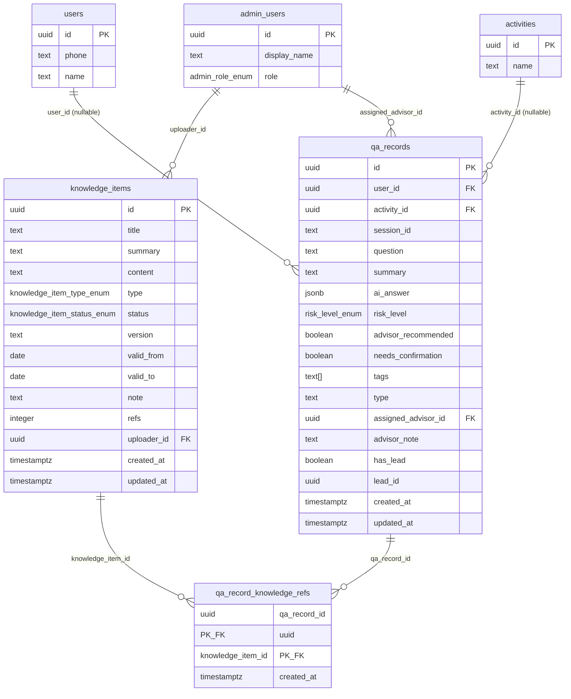

# 问答记录与知识库 数据库设计文档

**Migration 文件**：`supabase/migrations/20260610120005_create_qa_records_table.sql`
**编写日期**：2026-06-10
**依赖 Migration**：`20260610120001_create_activities_qrcodes_table`
**关联文档**：
- [`docs/mock-audit/问答记录-mock-audit.md`](../mock-audit/问答记录-mock-audit.md)
- [`docs/mock-audit/辅助模块（知识库-看板-设置）-mock-audit.md`](../mock-audit/辅助模块（知识库-看板-设置）-mock-audit.md)
- [`docs/api-contracts/问答记录.md`](../api-contracts/问答记录.md)

---

## 1. 实体关系图



---

## 2. 表结构说明

### 2.1 public.knowledge_items — 知识库条目

| 列名 | 类型 | 可空 | 默认值 | 说明 |
|------|------|------|--------|------|
| `id` | uuid | NOT NULL | gen_random_uuid() | 主键 |
| `title` | text | NOT NULL | — | 条目标题，不允许为空字符串 |
| `summary` | text | NOT NULL | '' | 摘要（精炼文本，非 content 截断），列表展示用 |
| `content` | text | NOT NULL | '' | 全文内容，RAG 切片数据来源；当前阶段可为空字符串 |
| `type` | knowledge_item_type_enum | NOT NULL | — | 类型枚举：faq / policy / case / manual |
| `status` | knowledge_item_status_enum | NOT NULL | 'pending' | 状态枚举：active / pending / inactive |
| `version` | text | NOT NULL | '1.0' | 版本号（如"2.1"），运营手动维护 |
| `valid_from` | date | NULL | NULL | 生效日期（仅日期），null 表示无起始限制 |
| `valid_to` | date | NULL | NULL | 失效日期（仅日期），null 表示长期有效 |
| `note` | text | NULL | NULL | 备注（来源说明、审核意见等） |
| `refs` | integer | NOT NULL | 0 | AI 引用次数，trigger 原子递增；当前阶段始终为 0 |
| `uploader_id` | uuid | NULL | NULL | 上传人 → admin_users(id)，ON DELETE SET NULL |
| `created_at` | timestamptz | NOT NULL | now() | 创建时间（UTC） |
| `updated_at` | timestamptz | NOT NULL | now() | 更新时间（UTC），trigger 自动维护 |

### 2.2 public.qa_records — AI 问答记录

| 列名 | 类型 | 可空 | 默认值 | 说明 |
|------|------|------|--------|------|
| `id` | uuid | NOT NULL | gen_random_uuid() | 主键 |
| `user_id` | uuid | NULL | NULL | 提问用户 → users(id)，ON DELETE SET NULL；null 表示匿名提问 |
| `activity_id` | uuid | NULL | NULL | 来源活动 → activities(id)，ON DELETE SET NULL；null 表示无活动上下文 |
| `session_id` | text | NULL | NULL | 多轮对话会话 id；null 表示单次独立问答 |
| `question` | text | NOT NULL | — | 用户提问原文，1-2000 字符 |
| `summary` | text | NOT NULL | '' | AI 生成的问题摘要（非 question 截断），admin 列表展示 |
| `ai_answer` | jsonb | NOT NULL | — | AI 回答完整结构体，见第 3 节 |
| `risk_level` | risk_level_enum | NOT NULL | — | 风险等级冗余列（从 ai_answer 解构，用于 B-Tree 索引） |
| `advisor_recommended` | boolean | NOT NULL | false | 是否建议人工顾问介入（冗余列） |
| `needs_confirmation` | boolean | NOT NULL | false | 是否"建议结合实际确认"（uncertain 映射，冗余列） |
| `tags` | text[] | NOT NULL | '' | AI 自动打标标签数组 |
| `type` | text | NOT NULL | '' | 问题类型（如"公转私风险"），AI 自动分类 |
| `assigned_advisor_id` | uuid | NULL | NULL | 分配的顾问 → admin_users(id)，ON DELETE SET NULL |
| `advisor_note` | text | NULL | NULL | 顾问备注，独立于 ai_answer，不覆盖 AI 内容 |
| `has_lead` | boolean | NOT NULL | false | 是否已生成线索（冗余标志） |
| `lead_id` | uuid | NULL | NULL | 关联线索 UUID，暂无 FK（见第 10 节） |
| `created_at` | timestamptz | NOT NULL | now() | 提问时间（UTC） |
| `updated_at` | timestamptz | NOT NULL | now() | 更新时间（UTC），trigger 自动维护 |

### 2.3 public.qa_record_knowledge_refs — 关联表

| 列名 | 类型 | 可空 | 默认值 | 说明 |
|------|------|------|--------|------|
| `qa_record_id` | uuid | NOT NULL | — | 联合主键，→ qa_records(id)，ON DELETE CASCADE |
| `knowledge_item_id` | uuid | NOT NULL | — | 联合主键，→ knowledge_items(id)，ON DELETE CASCADE |
| `created_at` | timestamptz | NOT NULL | now() | 关联创建时间（UTC） |

---

## 3. JSONB 字段 ai_answer 完整结构示例

`ai_answer` 列存储 `AiAnswerBodyDTO` 的完整序列化结果，是 AI 回答的权威数据来源。独立冗余列（`risk_level`、`advisor_recommended`、`needs_confirmation`）从此字段派生，用于索引加速查询。

```json
{
  "questionUnderstanding": "用户询问每月50-100万大额公转私操作的税务合规风险，属于高风险资金流动场景。",
  "initialJudgment": "大额、高频的公转私行为是金税四期重点监控对象，当前情况存在较高的税务合规风险。",
  "involvedRisks": [
    "资金流水异常预警：月均50-100万公转私频率较高，极易触发金税四期大数据预警",
    "个人所得税风险：资金性质不明确时，可能被认定为股东分红或工资薪酬，需补缴个税",
    "企业所得税风险：若无真实业务背景，转款可能被认定为虚假支出，影响税前扣除"
  ],
  "suggestions": [
    "立即梳理近12个月公转私明细，整理每笔转款的业务凭证和说明",
    "建议通过合规股息分红流程替代直接公转私，确保三流一致",
    "尽快约税务顾问进行专项体检，评估已有操作的风险敞口"
  ],
  "riskLevel": "high",
  "advisorRecommended": true,
  "needsConfirmation": false,
  "knowledgeItemIds": []
}
```

字段说明：

| 字段 | TypeScript 类型 | 说明 |
|------|----------------|------|
| `questionUnderstanding` | `string` | AI 对用户问题的理解说明（落地页"问题理解" section） |
| `initialJudgment` | `string` | AI 初步判断文本（落地页"初步判断" section） |
| `involvedRisks` | `string[]` | AI 识别的涉及风险列表（S4：统一为数组，替代 admin mock 的单字符串 `risks`） |
| `suggestions` | `string[]` | AI 处理建议列表（S4：统一为数组，替代 admin mock 的单字符串 `suggestion`） |
| `riskLevel` | `'low'\|'medium'\|'high'\|'critical'` | 风险等级（S4：统一英文四值枚举） |
| `advisorRecommended` | `boolean` | 是否建议人工顾问介入（S4：替代 admin mock 的 `manual` 字段） |
| `needsConfirmation` | `boolean` | 是否"建议结合实际确认"（`uncertain` 映射字段，见第 5 节） |
| `knowledgeItemIds` | `string[]` | 引用的知识库条目 id 列表（RAG 预留，当前阶段为 `[]`） |

---

## 4. 冗余字段说明

`qa_records` 表中以下三列与 `ai_answer` JSONB 的对应字段存在冗余：

| 独立列 | 对应 ai_answer 字段 | 冗余原因 |
|--------|-------------------|---------|
| `risk_level` | `ai_answer->>'riskLevel'` | 风险等级是最高频的筛选和统计字段（admin 列表筛选、统计卡片高风险计数）。JSONB 操作符查询无法利用 B-Tree 索引，在百万行数据规模下全表扫描性能不可接受；独立列支持 `WHERE risk_level = 'high'` 走索引。 |
| `advisor_recommended` | `ai_answer->>'advisorRecommended'` | 统计卡片"建议转人工数"需要全表聚合，独立 boolean 列配合部分索引（`WHERE advisor_recommended = true`）可实现极快的 COUNT 查询。 |
| `needs_confirmation` | `ai_answer->>'needsConfirmation'` | admin 侧过滤"建议结合实际确认"记录时需要独立列，否则只能用 `WHERE (ai_answer->>'needsConfirmation')::boolean = true` 走全表扫描。 |

双写一致性维护策略：
- 由服务层（`POST /api/ai/chat` Server Action）在写入 `ai_answer` 时同步写入三个冗余列，无需数据库触发器。
- 不加 CHECK 约束（如 `risk_level = (ai_answer->>'riskLevel')::risk_level_enum`），原因是 AI 回答可能经过服务端后处理（如 uncertain→medium 的映射），CHECK 约束会阻止这类合法的写入操作。
- 若未来需要修复历史数据中的不一致，可执行一次性对账 SQL：`UPDATE qa_records SET risk_level = (ai_answer->>'riskLevel')::risk_level_enum WHERE risk_level != (ai_answer->>'riskLevel')::risk_level_enum`。

---

## 5. uncertain → medium + needs_confirmation 映射说明

落地页 AI 问答（当前阶段为客户端关键词匹配）存在第三种风险判定状态 `"uncertain"`，表示"无法明确判断，建议结合实际情况确认"。此状态不进入 `risk_level_enum` 枚举，落库时按以下规则映射：

```
落地页 AI 回答              数据库存储
─────────────────────      ────────────────────────────────────────
riskLevel = "uncertain"  → risk_level = 'medium'
                           needs_confirmation = true
                           ai_answer.riskLevel = 'medium'
                           ai_answer.needsConfirmation = true
```

映射由服务端（`POST /api/ai/chat` 接口）处理，前端不感知存储细节。

admin 侧识别此类记录：
- 列表页：`needs_confirmation = true` 时可展示黄色角标（"待确认"）
- 统计：此类记录计入 `medium` 风险计数，可独立通过 `needsConfirmation=true` 筛选
- 筛选：`GET /api/admin/qa-records?needsConfirmation=true` 独立过滤

`risk_level_enum` 保持 `low / medium / high / critical` 四值不变，不新增 `uncertain` 枚举值。这一决策避免了枚举扩展带来的 DDL 变更，同时通过独立 boolean 列保留了完整语义。

---

## 6. 索引说明

### knowledge_items 索引

| 索引名 | 类型 | 列 | 用途 |
|--------|------|-----|------|
| `idx_knowledge_items_type` | B-Tree | `type` | 按类型筛选（FAQ 查询、知识库列表类型过滤器） |
| `idx_knowledge_items_status_active` | B-Tree 部分索引 | `id WHERE status='active'` | 落地页 FAQ 高频路径，只扫描生效条目 |
| `idx_knowledge_items_status` | B-Tree | `status` | admin 列表按全状态筛选 |
| `idx_knowledge_items_valid_from` | B-Tree 部分索引 | `valid_from WHERE NOT NULL` | 有效期起始筛选 |
| `idx_knowledge_items_valid_to` | B-Tree 部分索引 | `valid_to WHERE NOT NULL` | 有效期截止筛选 |
| `idx_knowledge_items_title_trgm` | GIN (pg_trgm) | `title` | 标题模糊搜索（知识库列表搜索框） |
| `idx_knowledge_items_uploader_id` | B-Tree 部分索引 | `uploader_id WHERE NOT NULL` | 按上传人筛选 |
| `idx_knowledge_items_refs_desc` | B-Tree | `refs DESC` | 按引用次数倒序排列 |

### qa_records 索引

| 索引名 | 类型 | 列 | 用途 |
|--------|------|-----|------|
| `idx_qa_records_user_id` | B-Tree 部分索引 | `user_id WHERE NOT NULL` | 查用户历史问答（端用户个人中心、用户详情页） |
| `idx_qa_records_activity_id` | B-Tree 部分索引 | `activity_id WHERE NOT NULL` | 按来源活动筛选（S1 修复） |
| `idx_qa_records_session_id` | B-Tree 部分索引 | `session_id WHERE NOT NULL` | 多轮对话会话聚合 |
| `idx_qa_records_risk_level` | B-Tree | `risk_level` | 风险等级精确筛选，统计卡片高风险计算 |
| `idx_qa_records_advisor_recommended` | B-Tree 部分索引 | `advisor_recommended WHERE = true` | 统计卡片"建议转人工数" |
| `idx_qa_records_needs_confirmation` | B-Tree 部分索引 | `needs_confirmation WHERE = true` | 过滤"建议结合实际确认"记录 |
| `idx_qa_records_assigned_advisor_id` | B-Tree 部分索引 | `assigned_advisor_id WHERE NOT NULL` | 查某顾问分配的问答记录 |
| `idx_qa_records_has_lead` | B-Tree 部分索引 | `has_lead WHERE = true` | 筛选已生成线索的记录 |
| `idx_qa_records_created_at_desc` | B-Tree | `created_at DESC` | 默认排序，分页稳定性 |
| `idx_qa_records_tags_gin` | GIN | `tags` | 标签包含查询（`@>` 操作符） |

### qa_record_knowledge_refs 索引

| 索引名 | 类型 | 列 | 用途 |
|--------|------|-----|------|
| `qa_record_knowledge_refs_pkey` | B-Tree（主键） | `(qa_record_id, knowledge_item_id)` | 幂等保护，前缀覆盖 qa_record_id 查询 |
| `idx_qa_refs_knowledge_item_id` | B-Tree | `knowledge_item_id` | 反向查询：某知识条目被哪些问答引用 |

---

## 7. RLS 策略

### 7.1 knowledge_items

| 策略名 | 操作 | 条件 | 角色 / 场景 |
|--------|------|------|------------|
| `knowledge_items_select_active_by_all` | SELECT | `status = 'active'` | 任何人（含匿名），落地页客服 FAQ |
| `knowledge_items_select_by_admin` | SELECT | `is_admin()` | 任意管理员，knowledge-base 管理页 |
| `knowledge_items_insert_by_manager` | INSERT | `get_my_admin_role() = 'manager'` | manager 角色 |
| `knowledge_items_update_by_manager` | UPDATE | `get_my_admin_role() = 'manager'` | manager 角色（含审核/停用） |
| `knowledge_items_delete_by_manager` | DELETE | `get_my_admin_role() = 'manager'` | manager 角色 |

说明：knowledge_items 写权限限于 manager，原因是知识库内容直接影响 AI 问答质量，写操作需要较高权限。若业务需要放开 market_ops 写权限，修改 INSERT/UPDATE/DELETE 策略中的角色条件即可。

### 7.2 qa_records

| 策略名 | 操作 | 条件 | 角色 / 场景 |
|--------|------|------|------------|
| `qa_records_select_self` | SELECT | `auth.uid() = user_id` | 已登录端用户，查自己的问答历史 |
| `qa_records_insert_by_user` | INSERT | `user_id IS NULL OR auth.uid() = user_id` | 已登录端用户（user_id 非空时验证），匿名提问走 Service Role |
| `qa_records_select_by_admin` | SELECT | `is_admin()` | 任意管理员，qa-records 管理页 |
| `qa_records_update_by_admin` | UPDATE | `get_my_admin_role() IN ('market_ops','tax_advisor','manager')` | 管理员操作：分配顾问、添加备注、更新线索状态 |

说明：
- 端用户 INSERT 策略的 `user_id IS NULL OR auth.uid() = user_id` 条件：匿名提问由 Service Role 处理（绕过 RLS），已登录提问由端用户 JWT 触发此策略。服务端始终通过 Service Role 写入，端用户直连场景的此策略作为兜底。
- 任何角色不能通过 RLS 删除问答记录，保留审计价值。

### 7.3 qa_record_knowledge_refs

| 策略名 | 操作 | 条件 | 角色 / 场景 |
|--------|------|------|------------|
| `qa_refs_select_by_admin` | SELECT | `is_admin()` | 任意管理员（查看引用关系） |

说明：INSERT / UPDATE / DELETE 仅 Service Role 执行（后端写入引用关系），普通用户和管理员均不能直接操作。

---

## 8. Trigger 说明

### 8.1 updated_at 自动更新

两张主表均通过 `public.set_updated_at()` 函数（定义于 migration 0）维护 `updated_at`：

```
knowledge_items_set_updated_at  — BEFORE UPDATE ON knowledge_items
qa_records_set_updated_at       — BEFORE UPDATE ON qa_records
```

`qa_record_knowledge_refs` 无 `updated_at` 字段（关联关系只增不改），无需 trigger。

### 8.2 knowledge_items.refs 原子递增机制

当 `qa_record_knowledge_refs` 新增一行时（AI 引用了一个知识条目），trigger `qa_refs_increment_knowledge` 自动将对应 `knowledge_items.refs` 原子递增 +1：

```sql
-- 函数
CREATE OR REPLACE FUNCTION public.increment_knowledge_refs()
RETURNS trigger LANGUAGE plpgsql AS $$
BEGIN
  UPDATE public.knowledge_items
  SET refs = refs + 1
  WHERE id = NEW.knowledge_item_id;
  RETURN NEW;
END;
$$;

-- trigger
CREATE TRIGGER qa_refs_increment_knowledge
  AFTER INSERT ON public.qa_record_knowledge_refs
  FOR EACH ROW
  EXECUTE FUNCTION public.increment_knowledge_refs();
```

设计决策：
- 使用 `AFTER INSERT`（而非 BEFORE），不阻塞关联表的写入事务。
- 原子性：`refs` 递增在同一数据库事务中，不会产生计数漂移。
- 当前阶段（RAG 未接入）：trigger 不会被触发，`refs` 始终为 0。
- 接入 RAG 后：服务端每次调用 AI 生成回答，将引用的 `knowledgeItemIds` 批量写入关联表，trigger 自动维护 `refs`。

注意：若需要减少 `refs`（如删除问答记录时），级联删除 `qa_record_knowledge_refs` 行不会触发递减 trigger（当前仅有递增 trigger）。`refs` 字段设计为只增不减，反映历史引用次数的累积统计，与业务需求一致。若需要精确当前引用数，可通过 `COUNT(qa_record_knowledge_refs)` 实时计算。

---

## 9. RAG 预留说明

当前阶段（RAG 未接入）的行为：
- `POST /api/ai/chat` 服务端使用关键词匹配或基础 LLM 生成回答
- `ai_answer.knowledgeItemIds` 始终为空数组 `[]`
- `qa_record_knowledge_refs` 表无任何写入
- `knowledge_items.refs` 始终为 0
- `knowledge_items.content` 已留空，但字段存在，等待 RAG 接入后填充

接入 RAG 后的扩展路径：

1. 填充 `knowledge_items.content`：将政策文档、FAQ 全文写入 `content` 列，作为向量化数据来源。
2. 向量检索（Supabase Vector / pgvector）：在 Supabase 中启用 `vector` 扩展，为 `knowledge_items` 增加 `embedding vector(1536)` 列，建立 HNSW 索引。此步骤通过新 migration 添加，不修改本 migration。
3. 写入引用关系：AI 生成回答时，服务端将命中的知识条目 id 批量 INSERT 到 `qa_record_knowledge_refs`，trigger 自动递增 `refs`。
4. 落地页展示参考来源：`AiChatResponseDTO.answer.knowledgeItemIds` 非空时，落地页可展示"参考来源"标题列表（从 `knowledge_items.title` 查询）。
5. 管理员可见引用链：admin 问答详情抽屉可展示"本次回答引用的知识条目"，通过 `qa_record_knowledge_refs JOIN knowledge_items` 实现。

---

## 10. 待完成（lead_id FK）

`qa_records.lead_id` 当前无外键约束，原因是 `leads` 表由并行 migration `20260610120003_create_leads_table` 创建。

待 migration 3 执行后，通过新 migration 补全约束：

```sql
-- 示例：补全 migration（文件名待确认，如 20260610120006_add_qa_records_lead_fk）
ALTER TABLE public.qa_records
  ADD CONSTRAINT qa_records_lead_id_fk
    FOREIGN KEY (lead_id)
    REFERENCES public.leads(id)
    ON DELETE SET NULL;
```

删除策略选择 `ON DELETE SET NULL` 的原因：线索删除后，问答记录本身仍有价值（历史分析），应保留记录并仅清除关联。`has_lead` 字段无需同步置为 false（保留历史标志，表示"曾经生成过线索"）。

---

## 11. 回滚方法

完整回滚 migration 20260610120005（逆序执行，仅在本地 / 非生产环境使用）：

```sql
-- 步骤 1：删除 trigger 和函数
DROP TRIGGER IF EXISTS qa_refs_increment_knowledge ON public.qa_record_knowledge_refs;
DROP TRIGGER IF EXISTS qa_records_set_updated_at ON public.qa_records;
DROP TRIGGER IF EXISTS knowledge_items_set_updated_at ON public.knowledge_items;
DROP FUNCTION IF EXISTS public.increment_knowledge_refs();

-- 步骤 2：删除表（CASCADE 同时删除索引、RLS 策略）
DROP TABLE IF EXISTS public.qa_record_knowledge_refs CASCADE;
DROP TABLE IF EXISTS public.qa_records CASCADE;
DROP TABLE IF EXISTS public.knowledge_items CASCADE;

-- 步骤 3：删除枚举类型
DROP TYPE IF EXISTS public.knowledge_item_type_enum;
DROP TYPE IF EXISTS public.knowledge_item_status_enum;
DROP TYPE IF EXISTS public.risk_level_enum;
```

注意事项：
- 若 migration 3（leads 表）已执行并在 `qa_records` 上添加了 `qa_records_lead_id_fk` 外键约束，需先执行该约束的 DROP CONSTRAINT，或同时回滚 migration 3。
- CASCADE 删除会同时清除所有依赖 `qa_records` 的视图和外键，确认无下游依赖后再执行。
- 回滚后 `risk_level_enum` 被删除，若其他表（如后续添加的 leads 表）也引用了此枚举，需先处理依赖。

---

## 12. 本地验证方法

在 Supabase 本地开发环境中执行以下 SQL 验证 migration 的正确性：

```sql
-- 1. 验证枚举类型已创建
SELECT typname, enumlabel
FROM pg_enum e
JOIN pg_type t ON e.enumtypid = t.oid
WHERE typname IN ('risk_level_enum', 'knowledge_item_status_enum', 'knowledge_item_type_enum')
ORDER BY typname, enumsortorder;
-- 期望结果：
--   knowledge_item_status_enum: active, pending, inactive
--   knowledge_item_type_enum:   faq, policy, case, manual
--   risk_level_enum:            low, medium, high, critical

-- 2. 验证表已创建
SELECT table_name FROM information_schema.tables
WHERE table_schema = 'public'
  AND table_name IN ('knowledge_items', 'qa_records', 'qa_record_knowledge_refs')
ORDER BY table_name;
-- 期望结果：3 行

-- 3. 验证外键约束
SELECT tc.table_name, kcu.column_name, ccu.table_name AS foreign_table
FROM information_schema.table_constraints tc
JOIN information_schema.key_column_usage kcu
  ON tc.constraint_name = kcu.constraint_name
JOIN information_schema.constraint_column_usage ccu
  ON tc.constraint_name = ccu.constraint_name
WHERE tc.constraint_type = 'FOREIGN KEY'
  AND tc.table_name IN ('knowledge_items', 'qa_records', 'qa_record_knowledge_refs')
ORDER BY tc.table_name, kcu.column_name;
-- 期望：knowledge_items.uploader_id → admin_users
--       qa_records.user_id → users
--       qa_records.activity_id → activities
--       qa_records.assigned_advisor_id → admin_users
--       qa_record_knowledge_refs.qa_record_id → qa_records
--       qa_record_knowledge_refs.knowledge_item_id → knowledge_items

-- 4. 验证 Check 约束
SELECT conname, pg_get_constraintdef(oid) AS definition
FROM pg_constraint
WHERE conrelid IN ('public.knowledge_items'::regclass, 'public.qa_records'::regclass)
  AND contype = 'c'
ORDER BY conname;
-- 期望：knowledge_items_title_not_empty_ck、knowledge_items_valid_period_ck、
--       knowledge_items_refs_non_negative_ck、
--       qa_records_question_length_ck、qa_records_ai_answer_is_object_ck

-- 5. 验证 trigger 已创建
SELECT trigger_name, event_object_table, event_manipulation, action_timing
FROM information_schema.triggers
WHERE trigger_schema = 'public'
  AND event_object_table IN ('knowledge_items', 'qa_records', 'qa_record_knowledge_refs')
ORDER BY event_object_table, trigger_name;
-- 期望：3 个 trigger（knowledge_items_set_updated_at、qa_records_set_updated_at、
--       qa_refs_increment_knowledge）

-- 6. 验证 seed 数据
SELECT id, title, type, status, refs FROM public.knowledge_items ORDER BY created_at;
-- 期望：3 条，分别为 active/active/pending 状态

SELECT id, summary, risk_level, advisor_recommended, needs_confirmation
FROM public.qa_records ORDER BY created_at;
-- 期望：2 条，分别为 high/true/false 和 medium/false/true

SELECT COUNT(*) FROM public.qa_record_knowledge_refs;
-- 期望：0（当前阶段 RAG 未接入）

-- 7. 验证 RLS 已启用
SELECT tablename, rowsecurity FROM pg_tables
WHERE schemaname = 'public'
  AND tablename IN ('knowledge_items', 'qa_records', 'qa_record_knowledge_refs');
-- 期望：3 行，rowsecurity 均为 true

-- 8. 验证 refs 递增 trigger（本地手动测试）
-- 先插入一条 qa_record（使用 seed 数据的 id）：
INSERT INTO public.qa_record_knowledge_refs (qa_record_id, knowledge_item_id)
VALUES (
  'f0000000-0000-0000-0000-000000000001'::uuid,
  'e0000000-0000-0000-0000-000000000001'::uuid
);
-- 验证 refs 已递增为 1：
SELECT id, title, refs FROM public.knowledge_items
WHERE id = 'e0000000-0000-0000-0000-000000000001'::uuid;
-- 期望：refs = 1

-- 9. 验证 ai_answer Check 约束（应拒绝非 object 类型）
-- 以下语句应报错 check_violation：
-- INSERT INTO public.qa_records (question, ai_answer, risk_level)
-- VALUES ('测试', '[]'::jsonb, 'low');
-- 错误：new row for relation "qa_records" violates check constraint "qa_records_ai_answer_is_object_ck"
```
